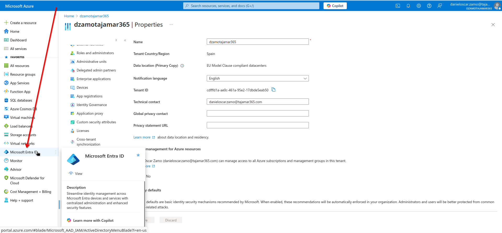
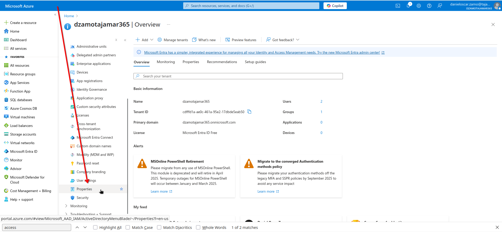
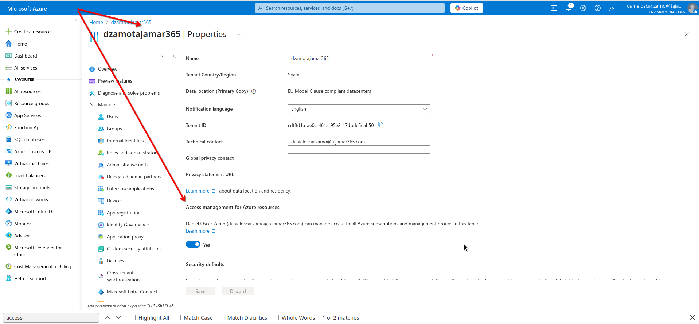
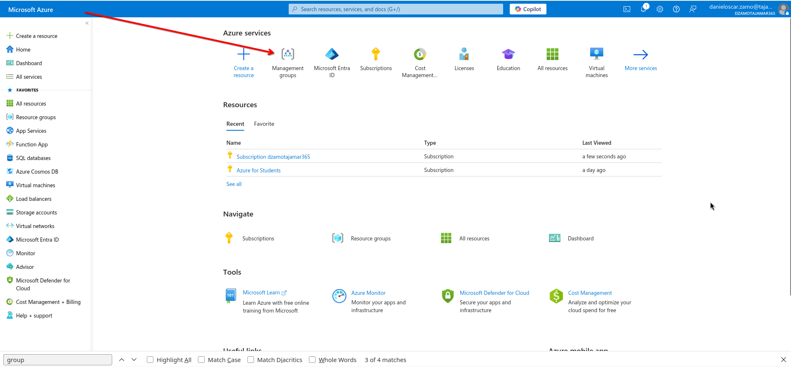
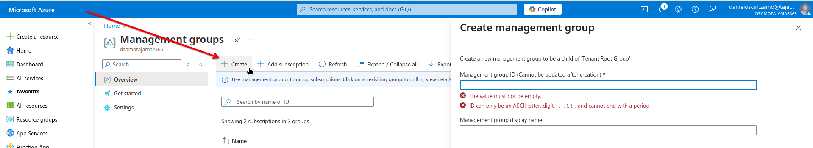
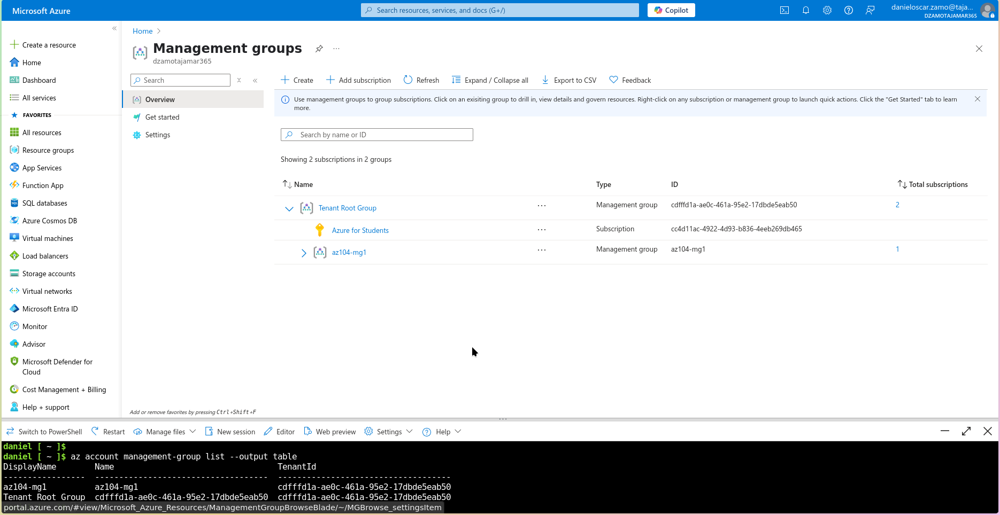

## Lab 02a - Manage Subscriptions and RBAC

### Lab introduction

In this lab, you learn about role-based access control. You learn how to
use permissions and scopes to control what actions identities can and
cannot perform. You also learn how to make subscription management
easier using management groups.

This lab requires an Azure subscription. Your subscription type may
affect the availability of features in this lab. You may change the
region, but the steps are written using **East US**.

### Lab scenario

To simplify management of Azure resources in your organization, you have
been tasked with implementing the following functionality:

- Creating a management group that includes all your Azure subscriptions.
- Granting permissions to submit support requests for all subscriptions in the management group. The permissions should be limited only to:
    - Create and manage virtual machines
    - Create support request tickets (do not include adding Azure providers)

**Architecture diagram**


**Job skills**

-   Task 1: Implement management groups.

-   Task 2: Review and assign a built-in Azure role.

-   Task 3: Create a custom RBAC role.

-   Task 4: Monitor role assignments with the Activity Log.

!!! info "Task 1: Implement Management Groups"
    In this task, you will create and configure management groups.
    Management groups are used to logically organize and segment subscriptions. They allow for RBAC and Azure Policy to be assigned and inherited to other management groups and subscriptions. For example, if your organization has a dedicated support team for Europe, you can organize European subscriptions into a management group to provide the support staff access to those subscriptions (without providing individual access to all subscriptions). In our scenario everyone at the Help Desk will need to create a support request across all subscriptions.

1.  Sign in to the **Azure portal** - https://portal.azure.com.

2.  Search for and select Microsoft Entra ID.



3.  In the **Manage** blade, select **Properties**.



4.  Review the **Access management for Azure resources** area. Ensure
    you can manage access to all Azure subscriptions and management
    groups in the tenant.



5.  Search for and select Management groups.



6.  On the **Management groups** blade, click **+ Create**.



7.  Create a management group with the following settings.
    Select **Submit** when you are done.

  -----------------------------------------------------------------------
  **Setting**                     **Value**
  ------------------------------- ---------------------------------------
  Management group ID             az104-mg1 (must be unique in the
                                  directory)

  Management group display name   az104-mg1
  -----------------------------------------------------------------------

*\# La creación se realizará utilizando Azure CLI Shell (bash)*

```bash
## Verificar instalación de Azure CLI
az --version

## Verificar mi suscripción activa
az account show

## Listar todas las suscripciones disponibles
az account list \
  --output table

# Obtener información del tenant actual
## -\> El siguiente comando necesita "extensiones account" (aceptar o rechazar, luego continuará)
az account tenant list

# Verificar permisos de gestión de acceso (requiere permisos de administrador)
az rest --method GET \ 
        --url "<https://graph.microsoft.com/v1.0/organization>" \
        --query "value[0].{displayName:displayName, id:id}"

# Crear nuevo grupo de administración
az account management-group create --name "az104-mg1" --display-name "az104-mg1"

# Verificar creación del grupo
az account management-group show --name "az104-mg1"

# Listar todos los grupos de administración para confirmar
az account management-group list --output table
```

8.  **Refresh** the management group page to ensure your new management
    group displays. This may take a minute.



*\# Tareas desde el Azure CLI Shell*\
*\## Verificar creación del grupo (Desde el CLI Azure)*\
az account management-group show \--name \"az104-mg1\"\
\
*\## Listar todos los grupos de administración para confirmar*\
az account management-group list \--output table


**Note:** Did you notice the root management group? The root management
group is built into the hierarchy to have all management groups and
subscriptions fold up to it. This root management group allows for
global policies and Azure role assignments to be applied at the
directory level. After creating a management group, you would add any
subscriptions that should be included in the group.

