**Lab 02a - Manage Subscriptions and RBAC**

**Lab introduction**

In this lab, you learn about role-based access control. You learn how to
use permissions and scopes to control what actions identities can and
cannot perform. You also learn how to make subscription management
easier using management groups.

This lab requires an Azure subscription. Your subscription type may
affect the availability of features in this lab. You may change the
region, but the steps are written using **East US**.

**Estimated timing: 30 minutes**

**Lab scenario**

To simplify management of Azure resources in your organization, you have
been tasked with implementing the following functionality:

-   Creating a management group that includes all your Azure
    subscriptions.

-   Granting permissions to submit support requests for all
    subscriptions in the management group. The permissions should be
    limited only to:

    -   Create and manage virtual machines

    -   Create support request tickets (do not include adding Azure
        providers)

**Architecture diagram**

**Job skills**

-   Task 1: Implement management groups.

-   Task 2: Review and assign a built-in Azure role.

-   Task 3: Create a custom RBAC role.

-   Task 4: Monitor role assignments with the Activity Log.

!!! info "Task 1: Implement Management Groups"
    In this task, you will create and configure management groups.
    Management groups are used to logically organize and segment subscriptions. They allow for RBAC and Azure Policy to be assigned and inherited to other management groups and subscriptions. For example, if your organization has a dedicated support team for Europe, you can organize European subscriptions into a management group to provide the support staff access to those subscriptions (without providing individual access to all subscriptions). In our scenario everyone at the Help Desk will need to create a support request across all subscriptions.

1.  Sign in to the **Azure portal** - https://portal.azure.com.

2.  Search for and select Microsoft Entra ID.

3.  In the **Manage** blade, select **Properties**.

4.  Review the **Access management for Azure resources** area. Ensure
    you can manage access to all Azure subscriptions and management
    groups in the tenant.

5.  Search for and select Management groups.

6.  On the **Management groups** blade, click **+ Create**.

{width="5.90625in"
height="1.0833333333333333in"}

7.  Create a management group with the following settings.
    Select **Submit** when you are done.

  -----------------------------------------------------------------------
  **Setting**                     **Value**
  ------------------------------- ---------------------------------------
  Management group ID             az104-mg1 (must be unique in the
                                  directory)

  Management group display name   az104-mg1
  -----------------------------------------------------------------------

*\# La creación se realizará utilizando Azure CLI Shell (bash)*

*\## Verificar instalación de Azure CLI*\
az \--version\
\
*\## Verificar mi suscripción activa*\
az account show\
\
*\## Listar todas las suscripciones disponibles*\
az account list \--output table\
\
*\# Obtener información del tenant actual*\
*\## -\> El siguiente comando necesita "extensiones account" (aceptar o
rechazar, luego continuará)*\
az account tenant list\
\
*\# Verificar permisos de gestión de acceso (requiere permisos de
administrador)*\
az rest \--method GET \--url
\"<https://graph.microsoft.com/v1.0/organization>\" \--query
\"value\[0\].{displayName:displayName, id:id}\"\
\
*\# Crear nuevo grupo de administración*\
az account management-group create \\\
\--name \"az104-mg1\" \\\
\--display-name \"az104-mg1\"\
\
*\# Verificar creación del grupo*\
az account management-group show \--name \"az104-mg1\"\
\
*\# Listar todos los grupos de administración para confirmar*\
az account management-group list \--output table

8.  **Refresh** the management group page to ensure your new management
    group displays. This may take a minute.

{width="5.90625in"
height="0.8571412948381453in"}

*\# Tareas desde el Azure CLI Shell*\
*\## Verificar creación del grupo (Desde el CLI Azure)*\
az account management-group show \--name \"az104-mg1\"\
\
*\## Listar todos los grupos de administración para confirmar*\
az account management-group list \--output table

{width="4.944376640419947in"
height="2.2708333333333335in"}

**Note:** Did you notice the root management group? The root management
group is built into the hierarchy to have all management groups and
subscriptions fold up to it. This root management group allows for
global policies and Azure role assignments to be applied at the
directory level. After creating a management group, you would add any
subscriptions that should be included in the group.

**Task 2: Review and assign a built-in Azure role**

In this task, you will review the built-in roles and assign the VM
Contributor role to a member of the Help Desk. Azure provides a large
number of [built-in
roles](https://learn.microsoft.com/azure/role-based-access-control/built-in-roles).

1.  Select the **az104-mg1** management group.

2.  Select the **Access control (IAM)** blade, and then
    the **Roles** tab.

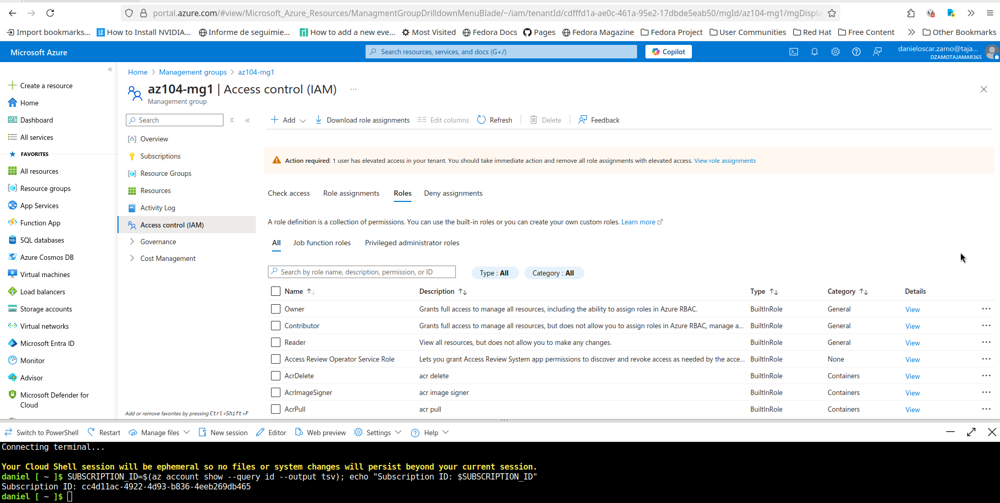{width="5.90625in"
height="1.833351924759405in"}

3.  Scroll through the built-in role definitions that are
    available. **View** a role to get detailed information about
    the **Permissions**, **JSON**, and **Assignments**. You will often
    use *owner*, *contributor*, and *reader*.

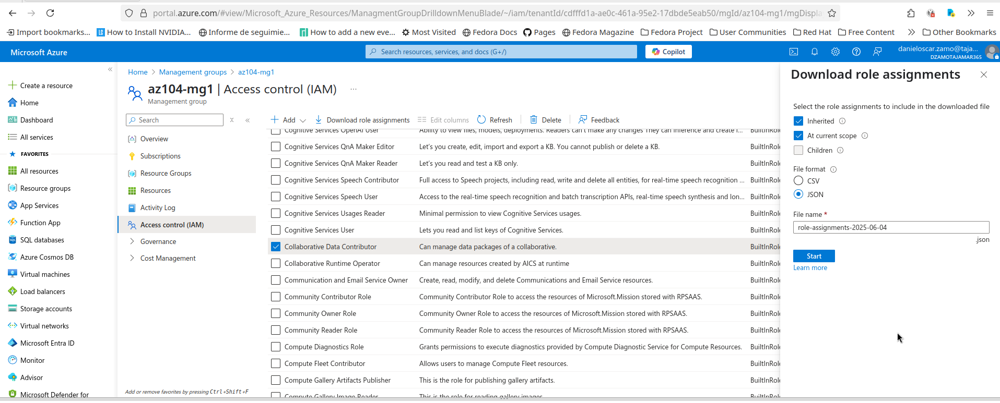{width="5.90625in"
height="2.1552471566054243in"}

4.  Select **+ Add**, from the drop-down menu, select **Add role
    assignment**.

5.  On the **Add role assignment** blade, search for and select
    the **Virtual Machine Contributor**. The Virtual machine contributor
    role lets you manage virtual machines, but not access their
    operating system or manage the virtual network and storage account
    they are connected to. This is a good role for the Help Desk.
    Select **Next**.

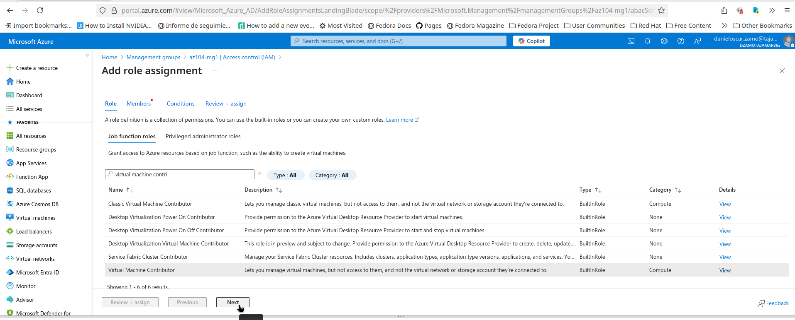{width="5.90625in"
height="2.102959317585302in"}

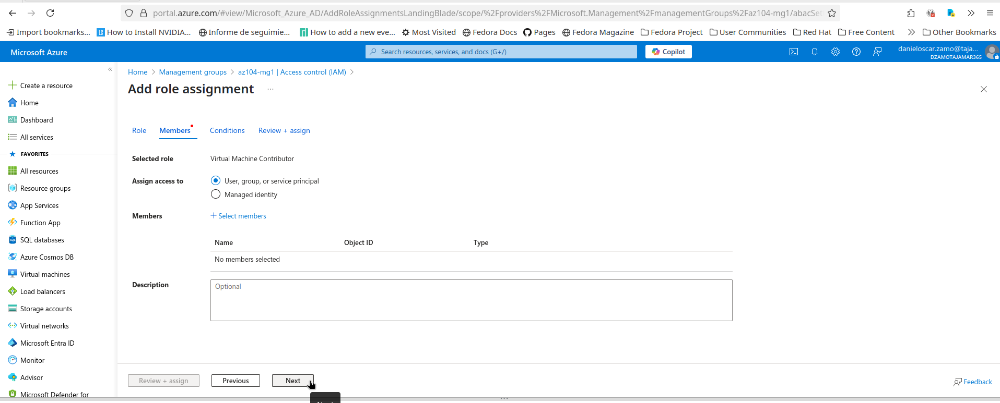{width="5.90625in"
height="2.1029352580927383in"}

**Did you know?** Azure originally provided only
the **Classic** deployment model. This has been replaced by the **Azure
Resource Manager** deployment model. As a best practice, do not use
classic resources.

*Tareas extras* (desde el CLI; necesarias para continuar luego).\
En este item se realizaran tareas extras pero utilizando el Azure CLI
Shell (bash), que nos serán necesarias para finalizar con esta practica.

*\# Obtener ID de la suscripción actual*\
SUBSCRIPTION_ID=\$(az account show \--query id \--output tsv)\
echo \"Subscription ID: \$SUBSCRIPTION_ID\"\
\
*\# Agregar suscripción al grupo de administración*\
az account management-group subscription add \\\
\--name \"az104-mg1\" \\\
\--subscription \"\$SUBSCRIPTION_ID\"\
\
*\# Verificar que la suscripción se agregó correctamente*\
az account management-group show \--name \"az104-mg1\" \--expand
--recurse

{width="4.541666666666667in"
height="2.2291666666666665in"}

*\# Verificar si el grupo helpdesk existe*\
az ad group list \--display-name \"helpdesk\" \--output table\
\
*\# Si no existe, crear el grupo helpdesk*\
az ad group create \\\
\--display-name \"helpdesk\" \\\
\--mail-nickname \"helpdesk\" \\\
\--description \"Grupo para el equipo de Help Desk\"\
\
*\# Obtener el Object ID del grupo helpdesk*\
HELPDESK_GROUP_ID=\$(az ad group show \--group \"helpdesk\" \--query id
\--output tsv)\
echo \"Helpdesk Group ID: \$HELPDESK_GROUP_ID\"

{width="4.572916666666667in"
height="2.5833333333333335in"}

*Creación grupo Help Desk*

*Con lo anterior se ha creado el grupo Help Desk.*

6.  On the **Members** tab, **Select Members**.

**Note:** The next step assigns the role to the **helpdesk** group. If
you do not have a Help Desk group, take a minute to create it.

7.  Search for and select the helpdesk group. Click **Select**.

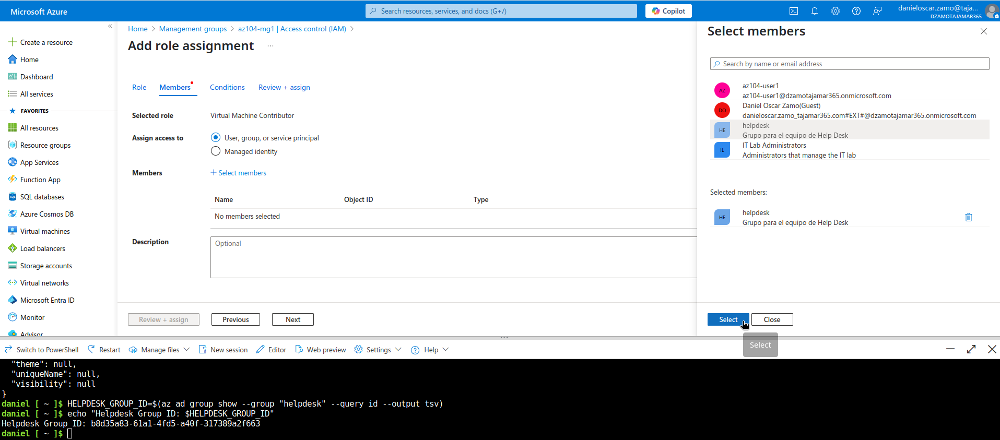{width="5.90625in"
height="1.867344706911636in"}

8.  Click **Review + assign** twice to create the role assignment.

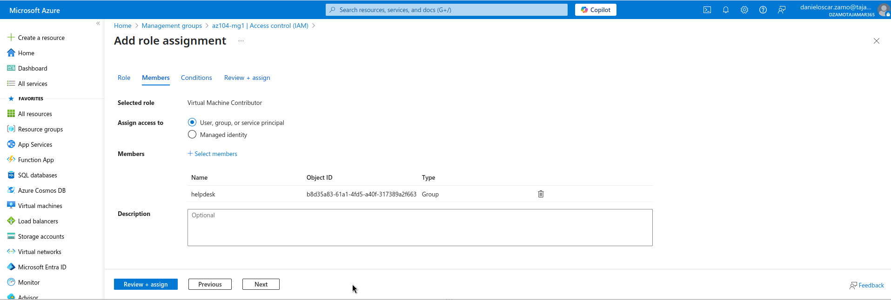{width="5.90625in"
height="1.7973097112860892in"}

9.  Continue on the **Access control (IAM)** blade. On the **Role
    assignments** tab, confirm the **helpdesk** group has the **Virtual
    Machine Contributor** role.

*Comandos CLI:* los comandos a continuación; realizan las mismas tareas,
de asignación de rol Virtual Machine Contributor al grupo Help Desk

*\# Obtener el ID del grupo de administración*\
MANAGEMENT_GROUP_ID=\"/providers/Microsoft.Management/managementGroups/az104-mg1\"\
\
*\# Asignar rol Virtual Machine Contributor al grupo helpdesk en el
grupo de administración*\
az role assignment create \\\
\--assignee \"\$HELPDESK_GROUP_ID\" \\\
\--role \"Virtual Machine Contributor\" \\\
\--scope \"\$MANAGEMENT_GROUP_ID\"\
\
*\# Verificar la asignación de rol*\
az role assignment list \\\
\--scope \"\$MANAGEMENT_GROUP_ID\" \\\
\--output table

{width="4.270833333333333in"
height="2.40625in"}

**Note:** As a best practice always assign roles to groups not
individuals.

**Did you know?** This assignment might not actually grant you any
additional privileges. If you already have the Owner role, that role
includes all permissions associated with the VM Contributor role.

**Task 3: Create a custom RBAC role**

In this task, you will create a custom RBAC role. Custom roles are a
core part of implementing the principle of least privilege for an
environment. Built-in roles might have too many permissions for your
scenario. We will also create a new role and remove permissions that are
not necessary. Do you have a plan for managing overlapping permissions?

1.  Continue working on your management group. Navigate to the **Access
    control (IAM)** blade.

2.  Select **+ Add**, from the drop-down menu, select **Add custom
    role**.

3.  On the Basics tab complete the configuration.

  -----------------------------------------------------------------------
  **Setting**           **Value**
  --------------------- -------------------------------------------------
  Custom role name      Custom Support Request

  Description           A custom contributor role for support requests.
  -----------------------------------------------------------------------

4.  For **Baseline permissions**, select **Clone a role**. In the **Role
    to clone** drop-down menu, select **Support Request Contributor**.

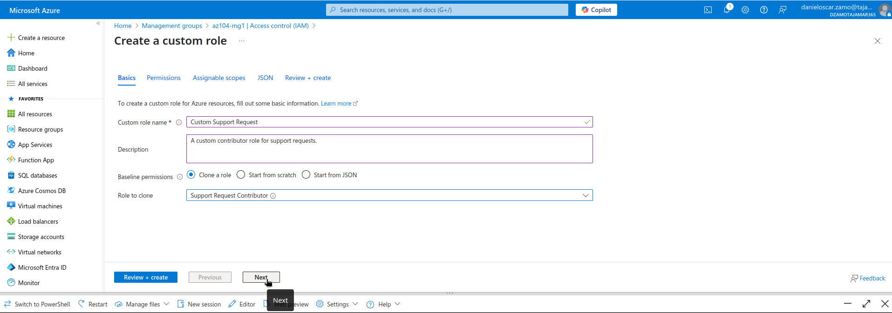{width="5.90625in"
height="2.0729166666666665in"}

5.  Select **Next** to move to the **Permissions** tab, and then
    select **+ Exclude permissions**.

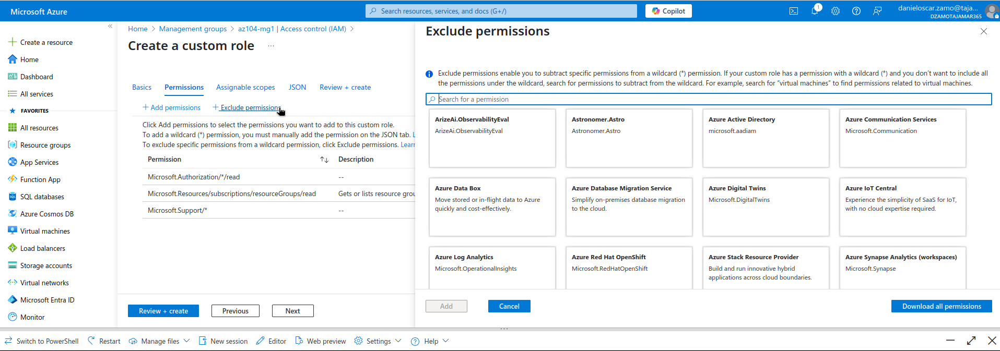{width="5.90625in"
height="2.0729166666666665in"}

6.  In the resource provider search field, enter .Support and
    select **Microsoft.Support**.

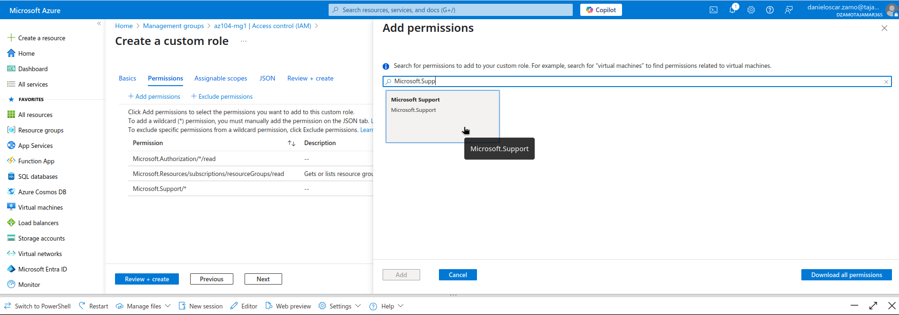{width="5.90625in"
height="2.0729166666666665in"}

7.  In the list of permissions, place a checkbox next to **Other:
    Registers Support Resource Provider** and then select **Add**. The
    role should be updated to include this permission as a *NotAction*.

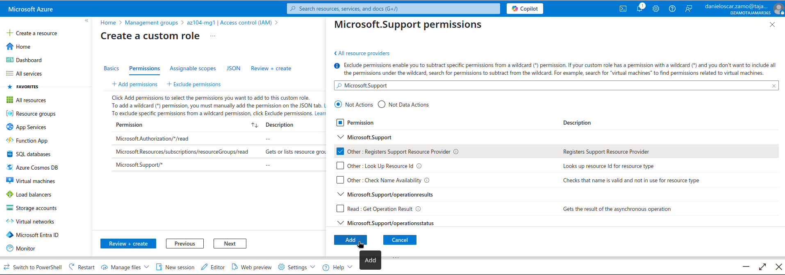{width="5.90625in"
height="2.0729166666666665in"}

## *Comandos CLI:* Crear Rol RBAC Personalizado

### Crear Definición de Rol Personalizado

*\# Crear archivo JSON para el rol personalizado*\
cat \> custom-support-role.json \<\< \'EOF\'\
{\
\"Name\": \"Custom Support Request\",\
\"Description\": \"A custom contributor role for support requests.\",\
\"Actions\": \[\
\"Microsoft.Support/\*\"\
\],\
\"NotActions\": \[\
\"Microsoft.Support/register/action\"\
\],\
\"AssignableScopes\": \[\
\"/providers/Microsoft.Management/managementGroups/az104-mg1\"\
\]\
}\
EOF\
\
*\# Mostrar el contenido del archivo creado*\
cat custom-support-role.json

### Crear el Rol Personalizado

*\# Crear el rol personalizado usando el archivo JSON*\
az role definition create \--role-definition custom-support-role.json\
\
*\# Verificar que el rol se creó correctamente*\
az role definition list \--name \"Custom Support Request\" \--output
table\
\
*\# Ver detalles completos del rol personalizado*\
az role definition list \--name \"Custom Support Request\" \--output
json

{width="4.729166666666667in"
height="2.6666666666666665in"}

*Creación del rol personalizado*

{width="4.822916666666667in"
height="2.71875in"}

*Verificación y ver detalles del rol personalizado*

**Note:** An Azure resource provider is a set of REST operations that
enable functionality for a specific Azure service. We do not want the
Help Desk to be able to have this capability, so it is being removed
from the cloned role.

8.  On the **Assignable scopes** tab, ensure your management group is
    listed, then click **Next**.

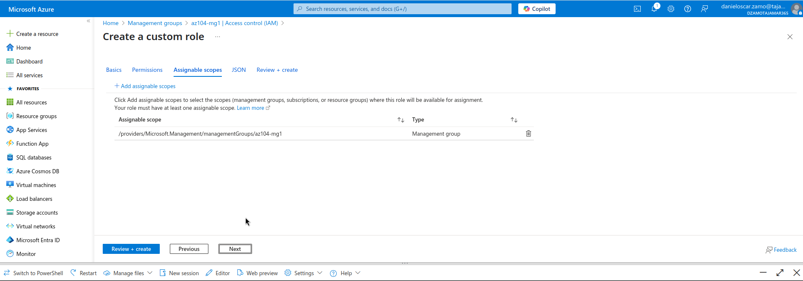{width="5.90625in"
height="2.0729166666666665in"}

9.  Review the JSON for the *Actions*, *NotActions*,
    and *AssignableScopes* that are customized in the role.

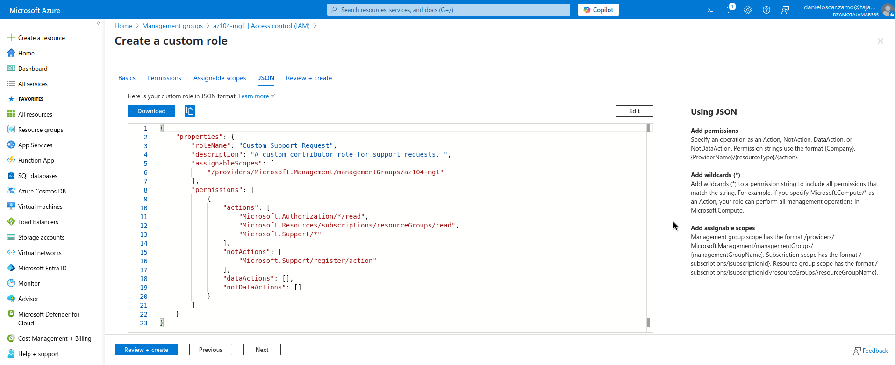{width="5.90625in"
height="2.1510990813648294in"}

10. Select **Review + Create**, and then select **Create**.

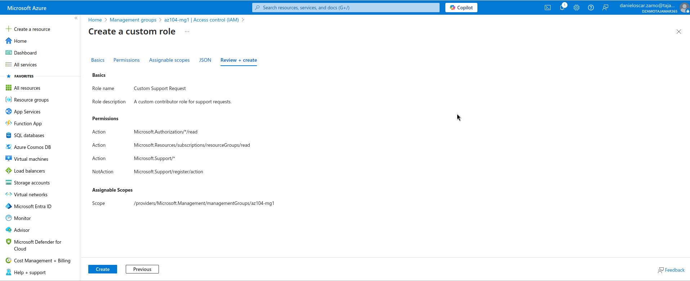{width="5.90625in"
height="2.1752416885389327in"}

### *Comandos CLI:* Asignar Rol Personalizado

*\# Asignar el rol personalizado al grupo helpdesk*\
az role assignment create \\\
\--assignee \"\$HELPDESK_GROUP_ID\" \\\
\--role \"Custom Support Request\" \\\
\--scope \"\$MANAGEMENT_GROUP_ID\"\
\
*\# Verificar todas las asignaciones de roles para el grupo de
administración*\
az role assignment list \\\
\--scope \"\$MANAGEMENT_GROUP_ID\" \\\
\--output table

{width="4.541666666666667in"
height="2.5625in"}

*Asignación del rol a Help Desk y verificación*

**Note:** At this point, you have created a custom role and assigned it
to the management group.

**Task 4: Monitor role assignments with the Activity Log**

In this task, you view the activity log to determine if anyone has
created a new role.

1.  In the portal locate the **az104-mg1** resource and
    select **Activity log**. The activity log provides insight into
    subscription-level events.

2.  Review the activites for role assignments. The activity log can be
    filtered for specific operations.

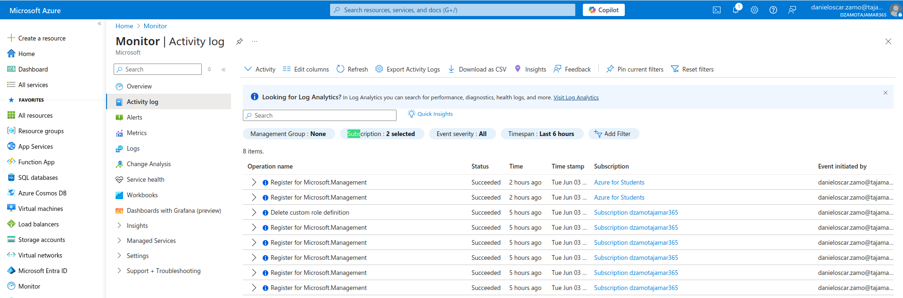{width="5.90625in"
height="1.4001432633420823in"}

## *Comandos CLI:* Monitorear Asignaciones de Roles con Activity Log

### Consultar Activity Log

### *\# Consultar actividades de creación de roles personalizados* az role definition list \--custom-role-only true \--output table

*\# Verificar asignaciones de roles*\
echo \"=== VERIFICACIÓN DIRECTA DE ASIGNACIONES ===\"\
az role assignment list \\\
\--scope \"/providers/Microsoft.Management/managementGroups/az104-mg1\"
\\\
\--output table\
\
*\# Ver detalles completos de las asignaciones*\
az role assignment list \\\
\--scope \"/providers/Microsoft.Management/managementGroups/az104-mg1\"
\\\
\--query \"\[\].{Assignee:principalName, Role:roleDefinitionName,
Scope:scope, Type:principalType}\" \\\
\--output table\
\
\# Debug: Ver todos los eventos recientes (últimas 2 horas)\
az monitor activity-log list \\\
\--start-time \$(date -u -d \'2 hours ago\' +%Y-%m-%dT%H:%M:%SZ) \\\
\--output table\
\
\# Debug: Ver estructura completa de un evento de Activity Log\
az monitor activity-log list \\\
\--max-events 1 \\\
\--output json\
\
*\# Los siguientes son también utilizando Activity Log (Puede tardar en
aparecer)*\
\
*\## Buscar específicamente eventos de creación de roles*\
az monitor activity-log list \\\
\--start-time \$(date -u -d \'4 hours ago\' +%Y-%m-%dT%H:%M:%SZ) \\\
\--query \"\[?contains(operationName.value,
\'roleDefinitions/write\')\].\[eventTimestamp, operationName.value,
caller, status.value\]\" \\\
\--output table\
\
*\## Buscar todos los eventos relacionados con definiciones de roles*\
az monitor activity-log list \\\
\--start-time \$(date -u -d \'4 hours ago\' +%Y-%m-%dT%H:%M:%SZ) \\\
\--query \"\[?contains(operationName.value,
\'roleDefinition\')\].\[eventTimestamp, operationName.value, caller,
status.value\]\" \\\
\--output table

*\# Actividades de definiciones de roles (crear/modificar roles
personalizados)*\
az monitor activity-log list \\\
\--start-time \$(date -u -d \'2 hours ago\' +%Y-%m-%dT%H:%M:%SZ) \\\
\--query \"\[?contains(operationName.value,
\'roleDefinition\')\].\[eventTimestamp, operationName.value, caller,
status.value\]\" \\\
\--output table

*\# Todos los eventos de autorización (más amplio)*\
az monitor activity-log list \\\
\--start-time \$(date -u -d \'2 hours ago\' +%Y-%m-%dT%H:%M:%SZ) \\\
\--query \"\[?resourceProviderName.value ==
\'Microsoft.Authorization\'\].\[eventTimestamp, operationName.value,
caller, status.value\]\" \\\
\--output table

{width="4.479166666666667in"
height="2.5208333333333335in"}

*Verificación de asignación de roles y otras consultas*

**Cleanup your resources**

If you are working with **your own subscription** take a minute to
delete the lab resources. This will ensure resources are freed up and
cost is minimized. The easiest way to delete the lab resources is to
delete the lab resource group.

-   In the Azure portal, select the resource group, select **Delete the
    resource group**, **Enter resource group name**, and then
    click **Delete**.

-   Using Azure PowerShell, Remove-AzResourceGroup -Name
    resourceGroupName.

-   Using the CLI, az group delete \--name resourceGroupName.

**Extend your learning with Copilot**

Copilot can assist you in learning how to use the Azure scripting tools.
Copilot can also assist in areas not covered in the lab or where you
need more information. Open an Edge browser and choose Copilot (top
right) or navigate to *copilot.microsoft.com*. Take a few minutes to try
these prompts.

-   Create two tables highlighting important PowerShell and CLI commands
    to get information about organization subscriptions on Azure and
    explain each command in the column "Explanation".

-   What is the format of the Azure RBAC JSON file?

-   What are the basic steps for creating a custom Azure RBAC role?

-   What is the difference between Azure RBAC roles and Microsoft Entra
    ID roles?

**Learn more with self-paced training**

-   [Secure your Azure resources with Azure role-based access control
    (Azure
    RBAC)](https://learn.microsoft.com/training/modules/secure-azure-resources-with-rbac/).
    Use Azure RBAC to manage access to resources in Azure.

-   [Create custom roles for Azure resources with role-based access
    control
    (RBAC)](https://learn.microsoft.com/training/modules/create-custom-azure-roles-with-rbac/).
    Understand the structure of role definitions for access control.
    Identify the role properties to use that define your custom role
    permissions. Create an Azure custom role and assign to a user.

**Key takeaways**

Congratulations on completing the lab. Here are the main takeaways for
this lab.

-   Management groups are used to logically organize subscriptions.

-   The built-in root management group includes all the management
    groups and subscriptions.

-   Azure has many built-in roles. You can assign these roles to control
    access to resources.

-   You can create new roles or customize existing roles.

-   Roles are defined in a JSON formatted file and
    include *Actions*, *NotActions*, and *AssignableScopes*.

-   You can use the Activity Log to monitor role assignments.
