# Lab 06 - Implement Traffic Management

## Lab introduction

In this lab, you learn how to configure and test a public Load Balancer and an Application Gateway.

This lab requires an Azure subscription. Your subscription type may affect the availability of features in this lab. You may change the region, but the steps are written using **East US**.

- Estimated timing: 50 minutes
- Lab scenario

  > Your organization has a public website. You need to load balance incoming public requests across different virtual machines. You also need to provide images and videos from different virtual machines. You plan on implementing an Azure Load Balancer and an Azure Application Gateway. All resources are in the same region.

- Interactive lab simulations

  >**Note**: The lab simulations that were previously provided have been retired.

### Job skills

+ Task 1: Use a template to provision an infrastructure.
+ Task 2: Configure an Azure Load Balancer.
+ Task 3: Configure an Azure Application Gateway.

## Task 1: Use a template to provision an infrastructure

In this task, you will use a template to deploy one virtual network, one network security group, and three virtual machines.

- Download the `./attachments/task-1/...` lab files (template and parameters).
- Sign in to the **Azure portal** - `https://portal.azure.com`.
- Search for and select `Deploy a custom template`.

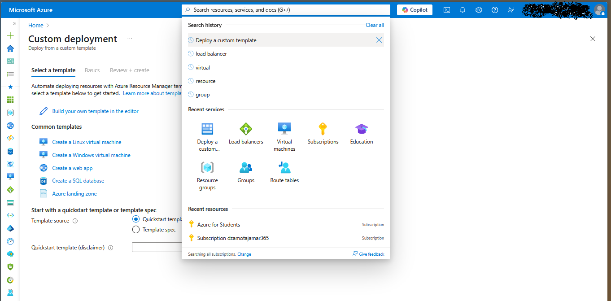

- On the custom deployment page, select **Build your own template in the editor**.
- On the edit template page, select **Load file**.
- Locate and select the `./attachments/task-1/az104-06-vms-template.json` file and select **Open**.
- Select **Save**.
- Select **Edit parameters** and load the `./attachments/task-1/az104-06-vms-parameters.json` file.
- Select **Save**.
- Use the following information to complete the fields on the custom deployment page, leaving all other fields with the default value.

    | Setting       | Value         |
    | ---           | ---           |
    | Subscription  | your Azure subscription |
    | Resource group | `az104-rg6` (If necessary, select **Create new**) |
    | Password      | Provide a secure password |

    >**Note**: If you receive an error that the VM size is unavailable, select a SKU that is available in your subscription and has at least 2 cores.

- Select **Review + Create** and then select **Create**.

    >**Note**: Wait for the deployment to complete before moving to the next task. The deployment should take approximately 5 minutes.
    >**Note**: Review the resources being deployed. There will be one virtual network with three subnets. Each subnet will have a virtual machine.

### Alternative: Deploy infrastructure using Azure CLI

You can also deploy the infrastructure using Azure Cloud Shell with the following commands:

_Assumptions met:_ The files `az104-06-vms-template.json` and `az104-06-vms-parameters.json` are already copied to the Azure Cloud Shell CLI.

```bash
# Create resource group
az group create --name az104-rg6 --location eastus

# Deploy ARM template
az deployment group create \
  --resource-group az104-rg6 \
  --template-file az104-06-vms-template.json \
  --parameters @az104-06-vms-parameters.json \
  --parameters adminPassword='YourSecurePassword123!'

# Verify deployment
az deployment group list --resource-group az104-rg6 --output table
```

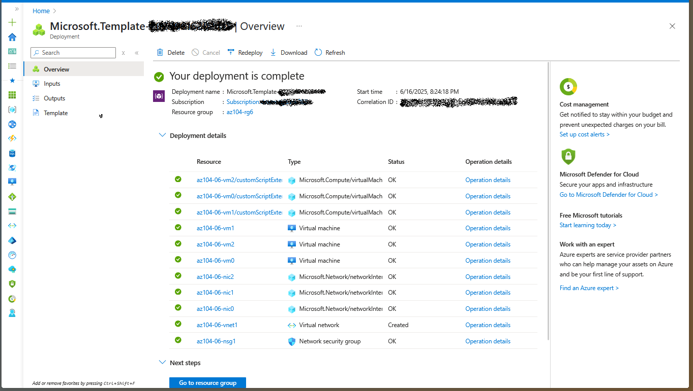

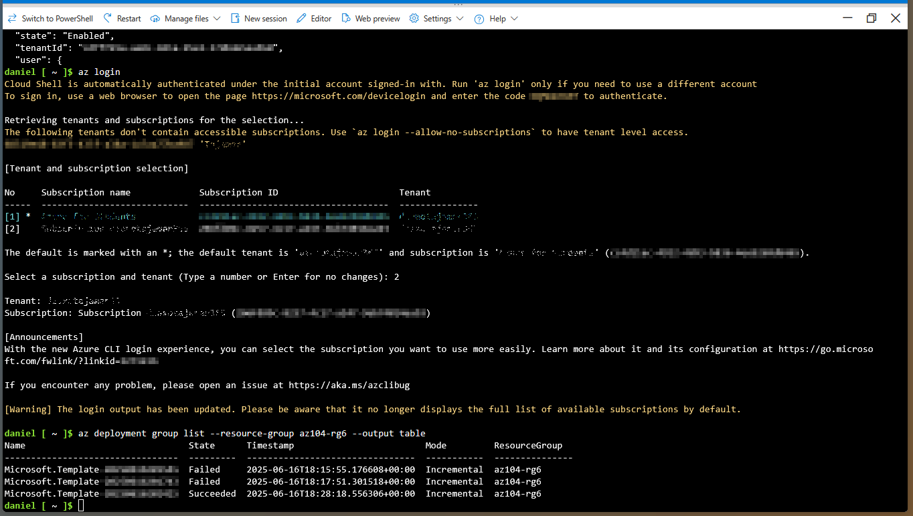

## Task 2: Configure an Azure Load Balancer

In this task, you implement an Azure Load Balancer in front of the two Azure virtual machines in the virtual network. Load Balancers in Azure provide layer 4 connectivity across resources, such as virtual machines. Load Balancer configuration includes a front-end IP address to accept connections, a backend pool, and rules that define how connections should traverse the load balancer.

## Architecture diagram - Load Balancer

>**Note**: Notice the Load Balancer is distributing across two virtual machines in the same virtual network.


- In the Azure portal, search for and select `Load balancers` and, on the **Load balancers** blade, click **+ Create**.

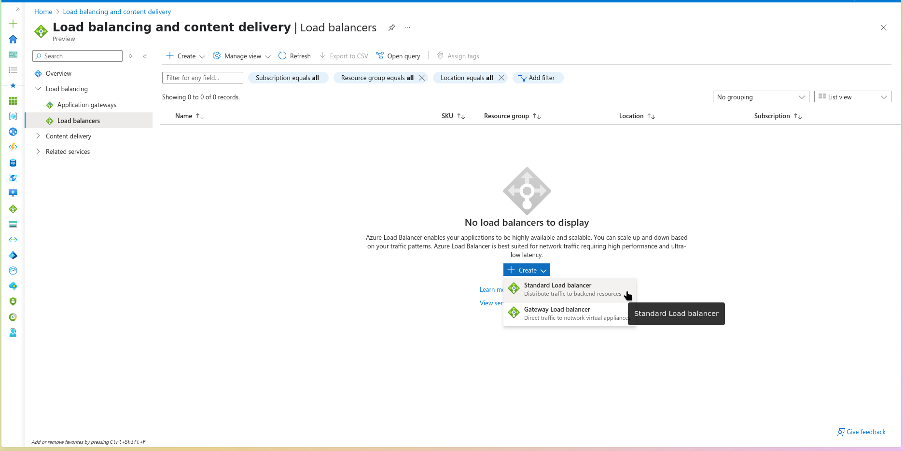

- Create a load balancer with the following settings (leave others with their default values) then click **Next: Frontend IP configuration**:

    | Setting | Value |
    | --- | --- |
    | Subscription | your Azure subscription |
    | Resource group | `az104-rg6` |
    | Name | `az104-lb` |
    | Region | The **same** region that you deployed the VMs |
    | SKU  | **Standard** |
    | Type | **Public** |
    | Tier | **Regional** |

     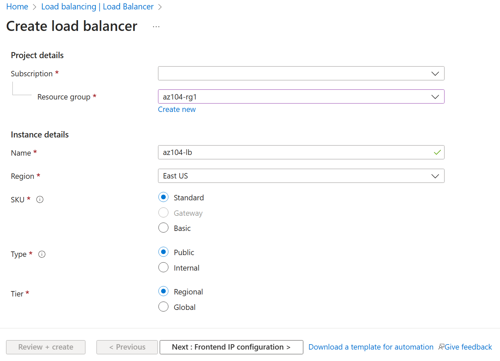

- On the **Frontend IP configuration** tab, click **Add a frontend IP configuration** and use the following settings:

    | Setting | Value |
    | --- | --- |
    | Name | `az104-fe` |
    | IP type | IP address |
    | Gateway Load Balancer | None |
    | Public IP address | Select **Create new** (use the instructions in the next step) |

- On the **Add a public IP address** popup, use the following settings before clicking **Save** twice. When completed click **Next: Backend pools**.

    | Setting | Value |
    | --- | --- |
    | Name | `az104-lbpip` |
    | SKU | Standard |
    | Tier | Regional |
    | Assignment | Static |
    | Routing Preference | **Microsoft network** |

    >**Note:** The Standard SKU provides a static IP address. Static IP addresses are assigned with the resource is created and released when the resource is deleted.

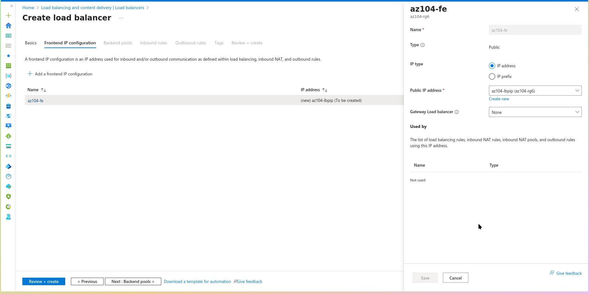

- On the **Backend pools** tab, click **Add a backend pool** with the following settings (leave others with their default values). Click **Add** and then **Save**. Click **Next: Inbound rules**.

    | Setting | Value |
    | --- | --- |
    | Name | `az104-be` |
    | Virtual network | **az104-06-vnet1** |
    | Backend Pool Configuration | **NIC** |
    | Click **Add** to add a virtual machine |  |
    | az104-06-vm0 | **check the box** |
    | az104-06-vm1 | **check the box** |

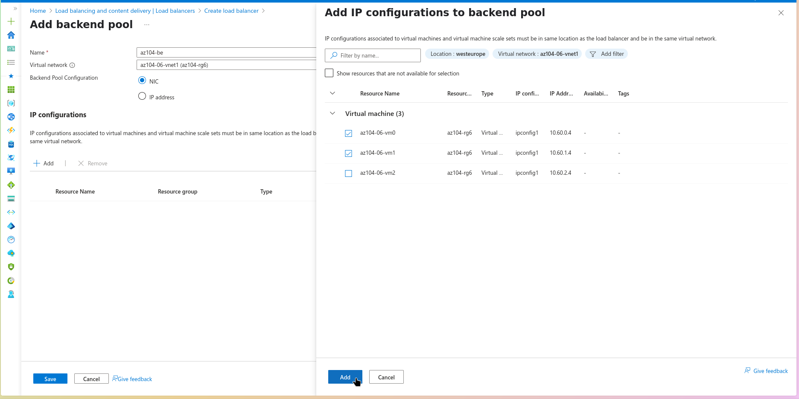

- As you have time, review the other tabs, then click **Review + create**. Ensure there are no validation errors, then click **Create**.

- Wait for the load balancer to deploy then click **Go to resource**.

### Alternative: Create Load Balancer using Azure CLI

```bash
# Create public IP for load balancer
az network public-ip create \
  --resource-group az104-rg6 \
  --name az104-lbpip \
  --sku Standard \
  --allocation-method Static

# Create load balancer
az network lb create \
  --resource-group az104-rg6 \
  --name az104-lb \
  --sku Standard \
  --public-ip-address az104-lbpip \
  --frontend-ip-name az104-fe \
  --backend-pool-name az104-be

# Add VMs to backend pool
az network nic ip-config address-pool add \
  --resource-group az104-rg6 \
  --nic-name az104-06-nic0 \
  --ip-config-name ipconfig1 \
  --lb-name az104-lb \
  --address-pool az104-be

az network nic ip-config address-pool add \
  --resource-group az104-rg6 \
  --nic-name az104-06-nic1 \
  --ip-config-name ipconfig1 \
  --lb-name az104-lb \
  --address-pool az104-be
```

**Add a rule to determine how incoming traffic is distributed**

- In the **Settings** blade, select **Load balancing rules**.

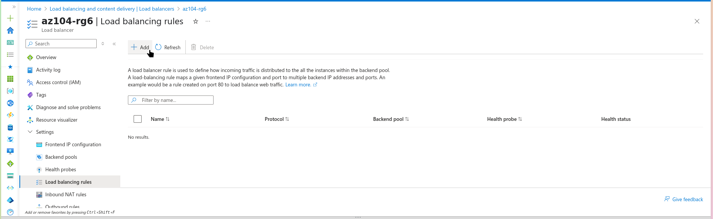

- Select **+ Add**. Add a load balancing rule with the following settings (leave others with their default values).  As you configure the rule use the informational icons to learn about each setting. When finished click **Save**.

    | Setting | Value |
    | --- | --- |
    | Name | `az104-lbrule` |
    | IP Version | `IPv4` |
    | Frontend IP Address | `az104-fe` |
    | Backend pool | `az104-be` |
    | Protocol | `TCP` |
    | Port | `80` |
    | Backend port | `80` |
    | Health probe | `Create new` |
    | Name | `az104-hp` |
    | Protocol | `TCP` |
    | Port | `80` |
    | Interval | `5` |
    | Close the create health probe window | `Save` |
    | Session persistence | `None` |
    | Idle timeout (minutes) | `4` |
    | TCP reset | `Disabled` |
    | Floating IP | `Disabled` |
    | Outbound source network address translation (SNAT) | `Recommended` |

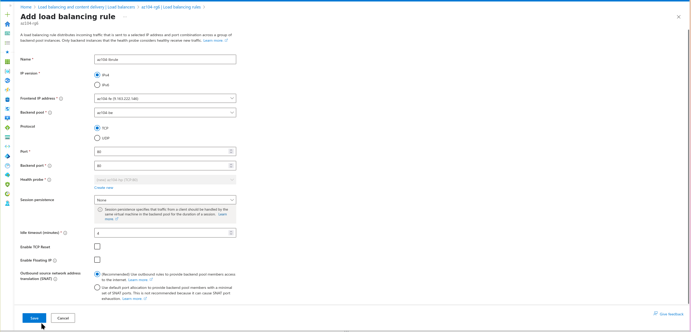

### Alternative: Create Load Balancing Rule using Azure CLI

```bash
# Create health probe
az network lb probe create \
  --resource-group az104-rg6 \
  --lb-name az104-lb \
  --name az104-hp \
  --protocol tcp \
  --port 80 \
  --interval 5

# Create load balancing rule
az network lb rule create \
  --resource-group az104-rg6 \
  --lb-name az104-lb \
  --name az104-lbrule \
  --protocol tcp \
  --frontend-port 80 \
  --backend-port 80 \
  --frontend-ip-name az104-fe \
  --backend-pool-name az104-be \
  --probe-name az104-hp
```

- Select **Frontend IP configuration** from the Load Balancer page. Copy the public IP address.

- Open another browser tab and navigate to the IP address. Verify that the browser window displays the message **Hello World from az104-06-vm0** or **Hello World from az104-06-vm1**.

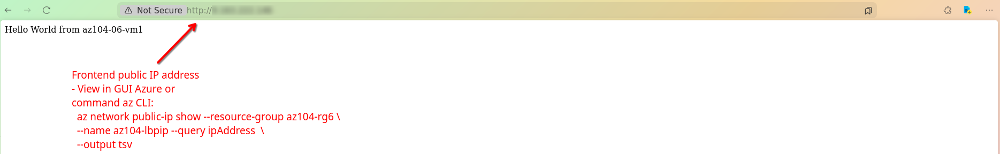

- Refresh the window to verify the message changes to the other virtual machine. This demonstrates the load balancer rotating through the virtual machines.

    > **Note**: You may need to refresh more than once or open a new browser window in InPrivate mode.

### Test Load Balancer using Azure CLI

```bash
# Get load balancer public IP
LB_IP=$(az network public-ip show \
  --resource-group az104-rg6 \
  --name az104-lbpip \
  --query ipAddress \
  --output tsv)

echo "Load Balancer IP: $LB_IP"
```

<!--
```
# Test load balancer (run multiple times to see load balancing)
## En este punto la siguiente no esta habilitada (es decir fallaría)
for i in {1..5}; do
  echo "Test $i:"
  curl -s http://$LB_IP/ || echo "Connection failed"
  echo ""
  sleep 2
done
```
-->

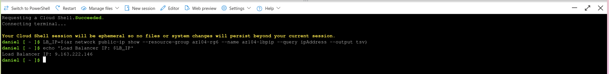

## Task 3: Configure an Azure Application Gateway

In this task, you implement an Azure Application Gateway in front of two Azure virtual machines. An Application Gateway provides layer 7 load balancing, Web Application Firewall (WAF), SSL termination, and end-to-end encryption to the resources defined in the backend pool. The Application Gateway routes images to one virtual machine and videos to the other virtual machine.

## Architecture diagram - Application Gateway

>**Note**: This Application Gateway is working in the same virtual network as the Load Balancer. This may not be typical in a production environment.


- In the Azure portal, search and select `Virtual networks`.

- On the **Virtual networks** blade, in the list of virtual networks, click **az104-06-vnet1**.

- On the **az104-06-vnet1** virtual network blade, in the **Settings** section, click **Subnets**, and then click **+ Subnet**.

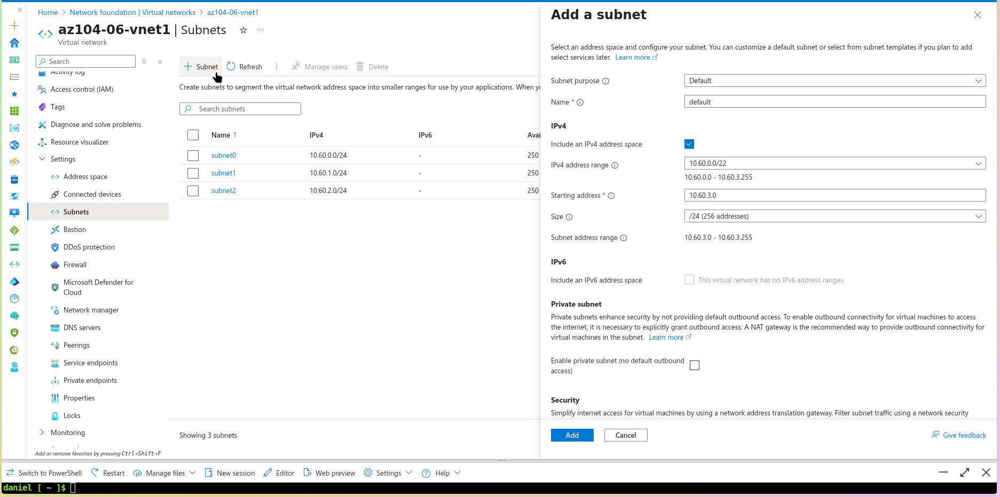

- Add a subnet with the following settings (leave others with their default values).

    | Setting | Value |
    | --- | --- |
    | Name | `subnet-appgw` |
    | Starting address| `10.60.3.224` |
    | Size | `/27` - Ensure the **starting address** is still **10.60.3.224**|

- Click **Add**

    > **Note**: This subnet will be used by the Azure Application Gateway. The Application Gateway requires a dedicated subnet of /27 or larger size.

### Alternative: Create Application Gateway Subnet using Azure CLI

```bash
# Add subnet for Application Gateway
az network vnet subnet create \
  --resource-group az104-rg6 \
  --vnet-name az104-06-vnet1 \
  --name subnet-appgw \
  --address-prefixes 10.60.3.224/27

# Verify subnet creation
az network vnet subnet show \
  --resource-group az104-rg6 \
  --vnet-name az104-06-vnet1 \
  --name subnet-appgw \
  --output table
```

- In the Azure portal, search and select `Application gateways` and, on the **Application Gateways** blade, click **+ Create**.

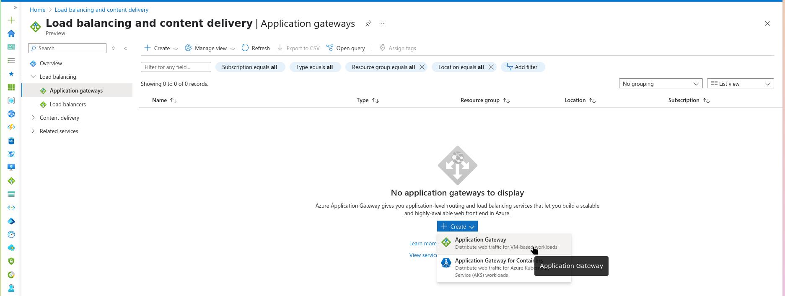

- On the **Basics** tab, specify the following settings (leave others with their default values):

    | Setting | Value |
    | --- | --- |
    | Subscription | your Azure subscription |
    | Resource group | `az104-rg6` |
    | Application gateway name | `az104-appgw` |
    | Region | The **same** Azure region that you used in Task 1 |
    | Tier | **Standard V2** |
    | Enable autoscaling | **No** |
    | Instance count | `2` |
    | HTTP2 | **Disabled** |
    | Virtual network | **az104-06-vnet1** |
    | Subnet | **subnet-appgw (10.60.3.224/27)** |

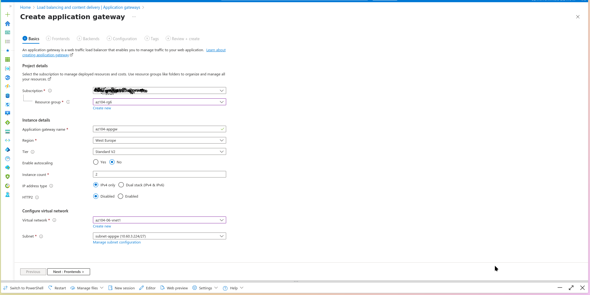

- Click **Next: Frontends >** and specify the following settings (leave others with their default values). When complete, click **OK**.

    | Setting | Value |
    | --- | --- |
    | Frontend IP address type | **Public** |
    | Public IP address| **Add new** |
    | Name | `az104-gwpip` |
    | Availability zone | **1** |

    >**Note:** The Application Gateway can have both a public and private IP address.

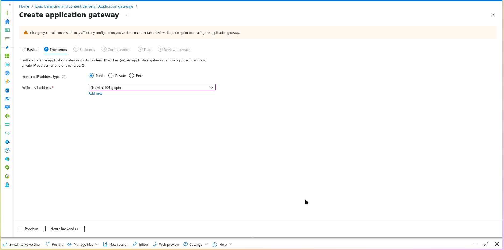

- Click **Next : Backends >** and then **Add a backend pool**. Specify the following settings (leave others with their default values). When completed click **Add**.

    | Setting | Value |
    | --- | --- |
    | Name | `az104-appgwbe` |
    | Add backend pool without targets | `No` |
    | Virtual machine | `az104-06-nic1 (10.60.1.4)` |
    | Virtual machine | `az104-06-nic2 (10.60.2.4)` |

- Click **Add a backend pool**. This is the backend pool for **images**. Specify the following settings (leave others with their default values). When completed click **Add**.

    | Setting | Value |
    | --- | --- |
    | Name | `az104-imagebe` |
    | Add backend pool without targets | `No` |
    | Virtual machine | `az104-06-nic1 (10.60.1.4)` |

- Click **Add a backend pool**. This is the backend pool for **video**. Specify the following settings (leave others with their default values). When completed click **Add**.

    | Setting | Value |
    | --- | --- |
    | Name | `az104-videobe` |
    | Add backend pool without targets | `No` |
    | Virtual machine | `az104-06-nic2 (10.60.2.4)` |

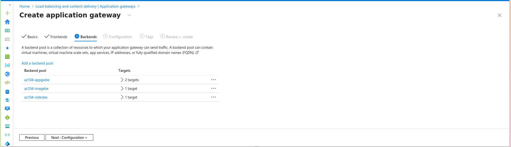

- Select **Next : Configuration >** and then **Add a routing rule**. Complete the information.

    | Setting | Value |
    | --- | --- |
    | Rule name | `az104-gwrule` |
    | Priority | `10` |
    | Listener name | `az104-listener` |
    | Frontend IP | `Public IPv4` |
    | Protocol | `HTTP` |
    | Port | `80` |
    | Listener type | `Basic` |

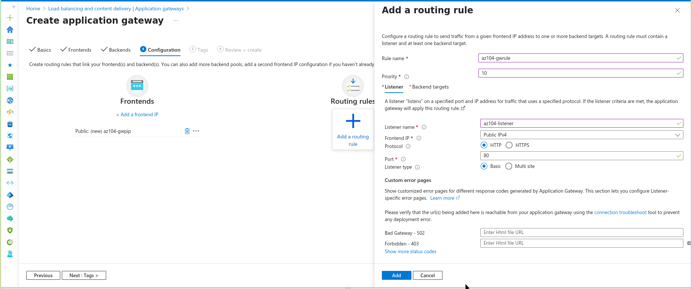

- Move to the **Backend targets** tab. Select **Add** after completing the basic information.

   | Setting | Value |
    | --- | --- |
    | Backend target | `az104-appgwbe` |
    | Backend settings | `az104-http` (create new) |

   >**Note:** Take a minute to read the information about **Cookie-based affinity** and **Connection draining**.

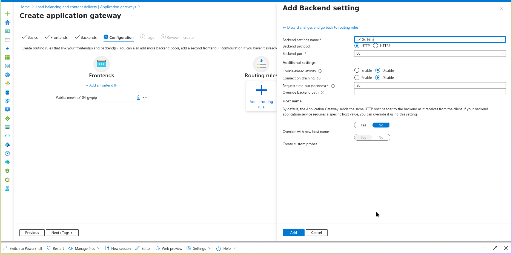

- In the **Path-based routing** section, select **Add multiple targets to create a path-based rule**. You will create two rules. Click **Add** after the first rule and then **Add** after the second rule.

    **Rule - routing to the images backend**

    | Setting | Value |
    | --- | --- |
    | Path | `/image/*` |
    | Target name | `images` |
    | Backend settings | `az104-http` |
    | Backend target | `az104-imagebe` |

    **Rule - routing to the videos backend**

    | Setting | Value |
    | --- | --- |
    | Path | `/video/*` |
    | Target name | `videos` |
    | Backend settings | `az104-http` |
    | Backend target | `az104-videobe` |

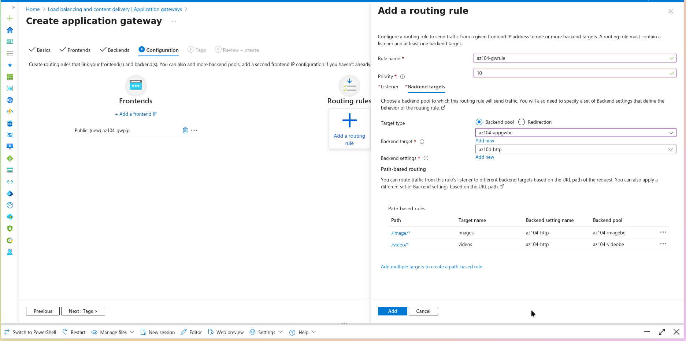

- Be sure to check your changes, then select **Next : Tags >**. No changes are needed.

- Select **Next : Review + create >** and then click **Create**.

    > **Note**: Wait for the Application Gateway instance to be created. This will take approximately 5-10 minutes. While you wait consider reviewing some of the self-paced training links at the end of this page.

    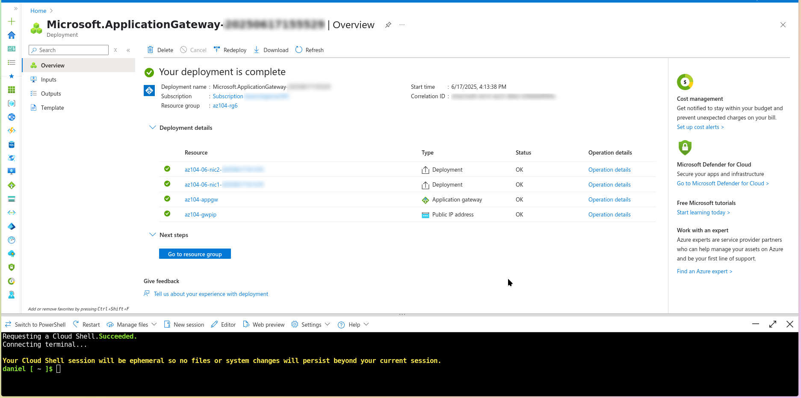

### Test Application Gateway using browser

- Start browser window and test this URL - `http://\<frontend ip address\>/`.

- Start another browser window and test this URL - `http://\<frontend ip address\>/image/`.

- Verify you are directed to the image server (vm1).

- Start another browser window and test this URL - `http://\<frontend ip address\>/video/`.

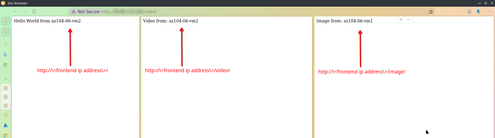

### Alternative: Create Application Gateway using Azure CLI

```bash
# Create public IP for Application Gateway
az network public-ip create \
  --resource-group az104-rg6 \
  --name az104-gwpip \
  --sku Standard \
  --allocation-method Static

# Create Application Gateway
az network application-gateway create \
  --resource-group az104-rg6 \
  --name az104-appgw \
  --location eastus \
  --capacity 2 \
  --sku Standard_v2 \
  --vnet-name az104-06-vnet1 \
  --subnet subnet-appgw \
  --public-ip-address az104-gwpip \
  --http-settings-cookie-based-affinity Disabled \
  --frontend-port 80 \
  --http-settings-port 80 \
  --http-settings-protocol Http

# Add backend pools
az network application-gateway address-pool create \
  --resource-group az104-rg6 \
  --gateway-name az104-appgw \
  --name az104-imagebe \
  --servers 10.60.1.4

az network application-gateway address-pool create \
  --resource-group az104-rg6 \
  --gateway-name az104-appgw \
  --name az104-videobe \
  --servers 10.60.2.4

# Create path-based routing rules
az network application-gateway url-path-map create \
  --resource-group az104-rg6 \
  --gateway-name az104-appgw \
  --name path-map \
  --paths /image/* \
  --address-pool az104-imagebe \
  --default-address-pool appGatewayBackendPool \
  --default-http-settings appGatewayBackendHttpSettings \
  --http-settings appGatewayBackendHttpSettings

az network application-gateway url-path-map rule create \
  --resource-group az104-rg6 \
  --gateway-name az104-appgw \
  --name video-rule \
  --path-map-name path-map \
  --paths /video/* \
  --address-pool az104-videobe \
  --http-settings appGatewayBackendHttpSettings
```

- After the application gateway deploys, search for and select **az104-appgw**.

- In the **Application Gateway** resource, in the **Monitoring** section, select **Backend health**.

- Ensure both servers in the backend pool display **Healthy**.

- On the **Overview** blade, copy the value of the **Frontend public IP address**.

- Start another browser window and test this URL - `http://<frontend ip address>/image/`.

- Verify you are directed to the image server (vm1).

- Start another browser window and test this URL - `http://<frontend ip address>/video/`.

- Verify you are directed to the video server (vm2).

> **Note**: You may need to refresh more than once or open a new browser window in InPrivate mode.

### Test Application Gateway using Azure CLI

```bash
# Get Application Gateway public IP
APPGW_IP=$(az network public-ip show \
  --resource-group az104-rg6 \
  --name az104-gwpip \
  --query ipAddress \
  --output tsv)

echo "Application Gateway IP: $APPGW_IP"

# Test image path routing
echo "Testing image path:"
curl -s http://$APPGW_IP/image/ || echo "Connection failed"

# Test video path routing
echo "Testing video path:"
curl -s http://$APPGW_IP/video/ || echo "Connection failed"

# Test default path
echo "Testing default path:"
curl -s http://$APPGW_IP/ || echo "Connection failed"
```

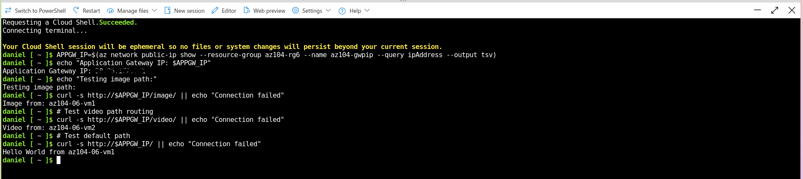

## Cleanup your resources

If you are working with **your own subscription** take a minute to delete the lab resources. This will ensure resources are freed up and cost is minimized. The easiest way to delete the lab resources is to delete the lab resource group.

+ In the Azure portal, select the resource group, select **Delete the resource group**, **Enter resource group name**, and then click **Delete**.
+ Using Azure PowerShell, `Remove-AzResourceGroup -Name resourceGroupName`.
+ Using the CLI, `az group delete --name resourceGroupName`.

### Cleanup using Azure CLI

```bash
# Delete the entire resource group and all resources
az group delete --name az104-rg6 --yes --no-wait

# Verify deletion (optional)
az group list --output table | grep az104-rg6
```

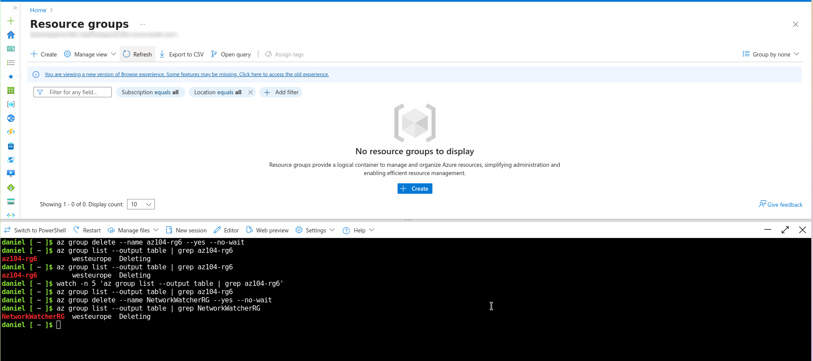

## Extend your learning with Copilot

Copilot can assist you in learning how to use the Azure scripting tools. Copilot can also assist in areas not covered in the lab or where you need more information. Open an Edge browser and choose Copilot (top right) or navigate to *copilot.microsoft.com*. Take a few minutes to try these prompts.

+ Compare and contrast the Azure Load Balancer with the Azure Application Gateway. Help me decide in which scenarios I should use each product.
+ What tools are available to troubleshoot connections to an Azure Load Balancer?
+ What are the basic steps for configuring the Azure Application Gateway? Provide a high-level checklist.
+ Create a table highlighting three Azure load balancing solutions. For each solution show supported protocols, routing policies, session affinity, and TLS offloading.

## Learn more with self-paced training

+ [Improve application scalability and resiliency by using Azure Load Balancer](https://learn.microsoft.com/training/modules/improve-app-scalability-resiliency-with-load-balancer/). Discuss the different load balancers in Azure and how to choose the right Azure load balancer solution to meet your requirements.
+ [Load balance your web service traffic with Application Gateway](https://learn.microsoft.com/training/modules/load-balance-web-traffic-with-application-gateway/). Improve application resilience by distributing load across multiple servers and use path-based routing to direct web traffic.

## Key takeaways

Congratulations on completing the lab. Here are the key points for this lab.

+ Azure Load Balancer is an excellent choice for distributing network traffic across multiple virtual machines at the transport layer (OSI layer 4 - TCP and UDP).
+ Public Load Balancers are used to load balance internet traffic to your VMs. An internal (or private) load balancer is used where private IPs are needed at the frontend only.
+ The Basic load balancer is for small-scale applications that don't need high availability or redundancy. The Standard load balancer is for high performance and ultra-low latency.
+ Azure Application Gateway is a web traffic (OSI layer 7) load balancer that enables you to manage traffic to your web applications.
+ The Application Gateway Standard tier offers all the L7 functionality, including load balancing, The WAF tier adds a firewall to check for malicious traffic.
+ An Application Gateway can make routing decisions based on additional attributes of an HTTP request, for example URI path or host headers.
