# Lab 07 - Manage Azure Storage

## Lab introduction

In this lab you learn to create storage accounts for Azure blobs and Azure files. You learn to configure and secure blob containers. You also learn to use Storage Browser to configure and secure Azure file shares.

This lab requires an Azure subscription. Your subscription type may affect the availability of features in this lab. You may change the region, but the steps are written using **East US**.

### Lab scenario

Your organization is currently storing data in on-premises data stores. Most of these files are not accessed frequently. You would like to minimize the cost of storage by placing infrequently accessed files in lower-priced storage tiers. You also plan to explore different protection mechanisms that Azure Storage offers, including network access, authentication, authorization, and replication. Finally, you want to determine to what extent Azure Files is suitable for hosting your on-premises file shares.

- Estimated timing: 50 minutes
- Certification: AZ-104
- Type: Laboratory
- Module: Administer Azure Storage

### Architecture diagram


### Job skills

- Task 1: Create and configure a storage account.
- Task 2: Create and configure secure blob storage.
- Task 3: Create and configure secure Azure file storage.

## Task 1: Create and configure a storage account.

In this task, you will create and configure a storage account. The storage account will use geo-redundant storage and will not have public access.

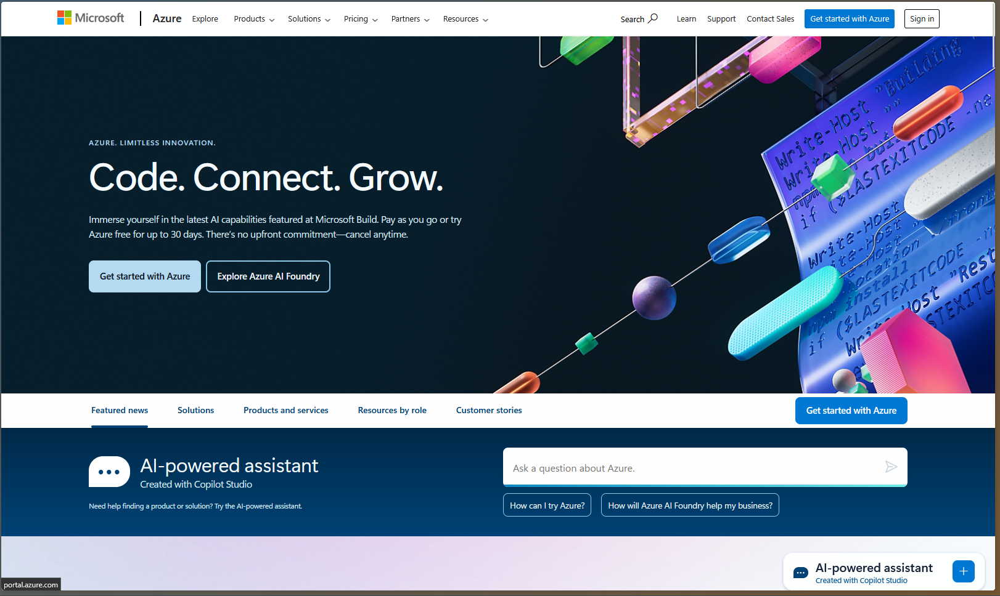

- Sign in to the **Azure portal** - `https://portal.azure.com`.
- Search for and select `Storage accounts`, and then click **+ Create**.
- On the **Basics** tab of the **Create a storage account** blade, specify the following settings (leave others with their default values):

| Setting                                                        | Value                                                                                                           |
| -------------------------------------------------------------- | --------------------------------------------------------------------------------------------------------------- |
| Subscription                                                   | the name of your Azure subscription                                                                             |
| Resource group                                                 | `az104-rg7` (create new)                                                                                        |
| Storage account name                                           | `az104rg7dzstorageaccount` any globally unique name between 3 and 24 in length consisting of letters and digits |
| Region                                                         | `(Europe) West Europe`                                                                                          |
| Performance                                                    | `Standard` (notice the Premium option)                                                                          |
| Redundancy                                                     | `Geo-redundant storage` (notice the other options)                                                              |
| Make read access to data in the event of regional availability | Check the box                                                                                                   |

  >**Did you know?** You should use the Standard performance tier for most applications. Use the Premium performance tier for enterprise or high-performance applications.

- On the **Advanced** tab, use the informational icons to learn more about the choices. Take the defaults.
- On the **Networking** tab, in the **Network access** section, select `Disable public access and use private access`. This will restrict inbound access while allowing outbound access.
- Review the **Data protection** tab. Notice 7 days is the default soft delete retention policy. Note you can enable versioning for blobs. Accept the defaults.
- Review the **Encryption** tab. Notice the additional security options. Accept the defaults.
- Select **Review + Create**, wait for the validation process to complete, and then click **Create**.
- Once the storage account is deployed, select **Go to resource**.
- Review the **Overview** blade and the additional configurations that can be changed. These are global settings for the storage account. Notice the storage account can be used for Blob containers, File shares, Queues, and Tables.
- In the **Security + networking** blade, select **Networking**. Notice **Public network access** is disabled.

  - Change the **Public network access** to **Enable from selected networks and IP addresses**.
  - In the **Firewall** section, select the checkbox to **Add your client IP address**.
  - Save your changes.

- In the **Data management** blade, select **Redundancy**. Notice the information about your primary and secondary data center locations.
- In the **Data management** blade, select **Lifecycle management**, and then select **Add a rule**.

  - **Name** the rule `Movetocool`. Notice your options for limiting the scope of the rule. Click **Next**.
  - On the **Base blobs** tab, *if* based blobs were last modified more than `30 days` ago *then* **Move to cool storage**. Notice your other choices.
  - Notice you can configure other conditions. Select **Add** when you are done exploring.

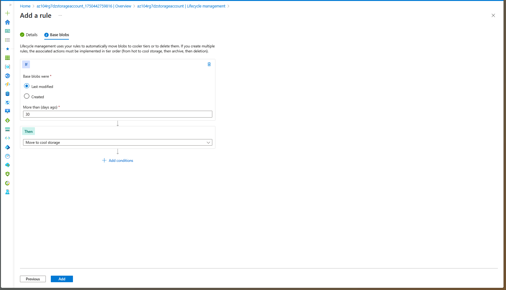

### Azure Cloud Shell (Bash)


- Open Azure Cloud Shell and select **Bash**.


- Create the resource group:

  ```bash
  # Set variables
  RESOURCE_GROUP="az104-rg"
  LOCATION="eastus"
  STORAGE_ACCOUNT_NAME="storageaccount$(date +%s)"

  # Create resource group
  az group create --name $RESOURCE_GROUP --location $LOCATION
  ```


- Create the storage account with geo-redundant storage:

  ```bash
  # Create storage account
  az storage account create \
    --name $STORAGE_ACCOUNT_NAME \
    --resource-group $RESOURCE_GROUP \
    --location $LOCATION \
    --sku Standard_GRS \
    --kind StorageV2 \
    --access-tier Hot \
    --allow-blob-public-access false \
    --public-network-access Disabled
  ```

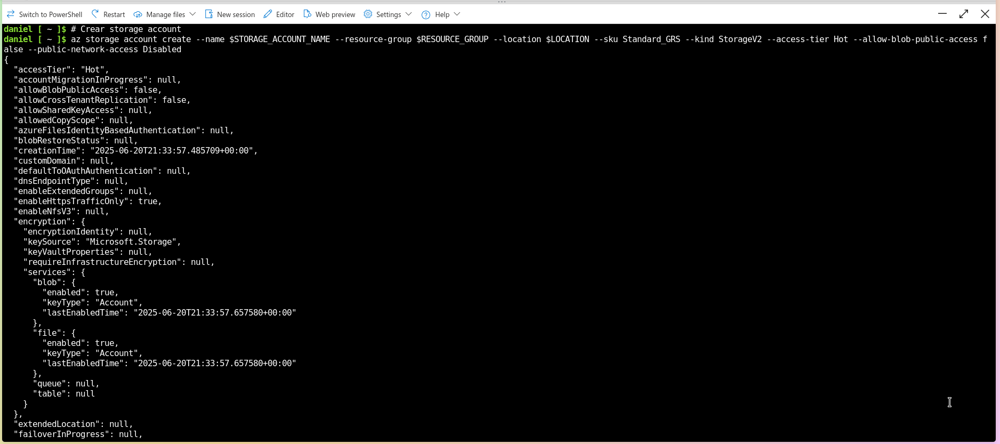

- Enable read access for geo-redundant storage:

  ```bash
  # Update storage account to enable read access geo-redundant storage
  az storage account update \
    --name $STORAGE_ACCOUNT_NAME \
    --resource-group $RESOURCE_GROUP \
    --sku Standard_RAGRS
  ```

- Configure networking to allow access from selected networks:

  ```bash
  # Get your public IP
  MY_IP=$(curl -s https://ipinfo.io/ip)

  # Update network access
  az storage account update \
    --name $STORAGE_ACCOUNT_NAME \
    --resource-group $RESOURCE_GROUP \
    --public-network-access Enabled \
    --default-action Deny
  # Add your IP to firewall rules
  az storage account network-rule add \
    --resource-group $RESOURCE_GROUP \
    --account-name $STORAGE_ACCOUNT_NAME \
    --ip-address $MY_IP
  ```

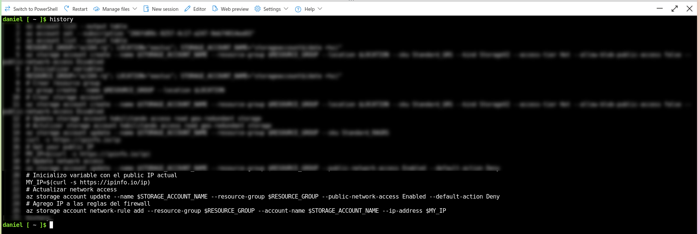

- Create lifecycle management policy:

```bash
# Create lifecycle policy JSON
cat > lifecycle-policy.json << EOF
  {
  "rules": [
    {
      "name": "Movetocool",
      "enabled": true,
      "type": "Lifecycle",
      "definition": {
        "filters": {
          "blobTypes": ["blockBlob"]
        },
        "actions": {
          "baseBlob": {
            "tierToCool": {
              "daysAfterModificationGreaterThan": 30
            }
          }
        }
      }
    }
  ]
  }
EOF

# Apply lifecycle policy
az storage account management-policy create \
  --account-name $STORAGE_ACCOUNT_NAME \
  --resource-group $RESOURCE_GROUP \
  --policy @lifecycle-policy.json
```

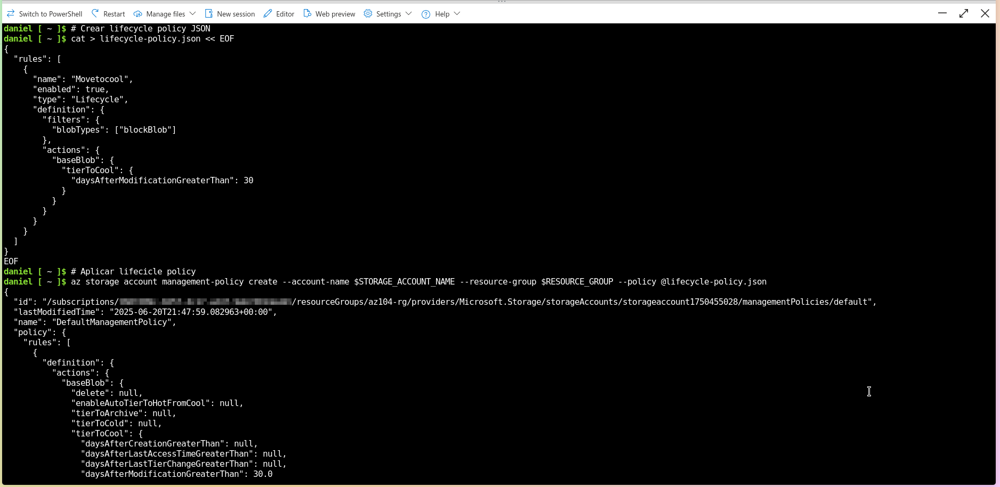


_List, review, and delete the entire Resource Group and/or Storage Account_

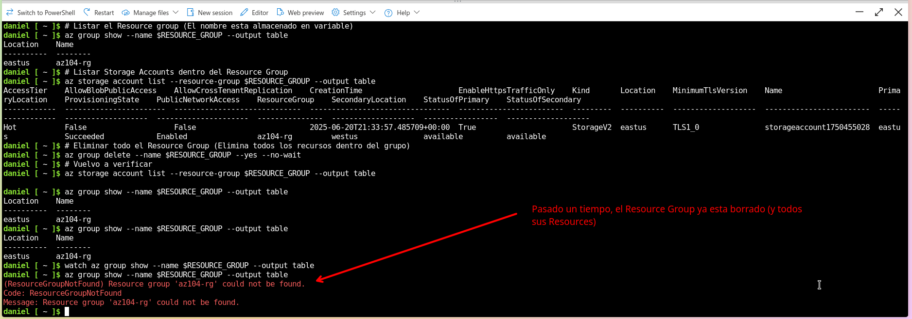

## Task 2: Create and configure secure blob storage

In this task, you will create a blob container and upload an image. Blob containers are directory-like structures that store unstructured data.

### Create a blob container and a time-based retention policy

- Continue in the Azure portal, working with your storage account.

- In the **Data storage** blade, select **Containers**.

- Click **+ Add container** and **Create** a container with the following settings:

| Setting             | Value                                     |
| ------------------- | ----------------------------------------- |
| Name                | `data`                                    |
| Public access level | Notice the access level is set to private |

- On your container, scroll to the `ellipsis (…)` on the far right, select **Access Policy**.
- In the **Immutable blob storage** area, select **Add policy**.

    | Setting                  | Value                  |
    | ------------------------ | ---------------------- |
    | Policy type              | `Time-based retention` |
    | Set retention period for | `180` days             |

- Select **Save**.

### Manage blob uploads

- Return to the containers page, select your **data** container and then click **Upload**.
- On the **Upload blob** blade, expand the **Advanced** section.

    >**Note**: Locate a file to upload. This can be any type of file, but a small file is best. A sample file can be downloaded from the AllFiles directory.

    | Setting          | Value                                    |
    | ---------------- | ---------------------------------------- |
    | Browse for files | add the file you have selected to upload |
    | Select           | **Advanced**                             |
    | Blob type        | `Block blob`                             |
    | Block size       | `4 MiB`                                  |
    | Access tier      | `Hot`  (notice the other options)        |
    | Upload to folder | `securitytest`                           |
    | Encryption scope | Use existing default container scope     |

- Click **Upload**.
- Confirm you have a new folder, and your file was uploaded.
- Select your upload file and review the options including **Download**, **Delete**, **Change tier**, and **Acquire lease**.
- Copy the file **URL** (Properties blade) and paste into a new **Inprivate** browsing window.
- You should be presented with an XML-formatted message stating **ResourceNotFound** or **PublicAccessNotPermitted**.

    > **Note**: This is expected, since the container you created has the public access level set to **Private (no anonymous access)**.

### Configure limited access to the blob storage

- Browse back to the file that you uploaded and select the `ellipsis (…)` to the far right, then select **Generate SAS** and specify the following settings (leave others with their default values):

    | Setting              | Value                                |
    | -------------------- | ------------------------------------ |
    | Signing key          | **Key 1**                            |
    | Permissions          | **Read** (notice your other choices) |
    | Start date           | yesterday's date                     |
    | Start time           | current time                         |
    | Expiry date          | tomorrow's date                      |
    | Expiry time          | current time                         |
    | Allowed IP addresses | leave blank                          |

    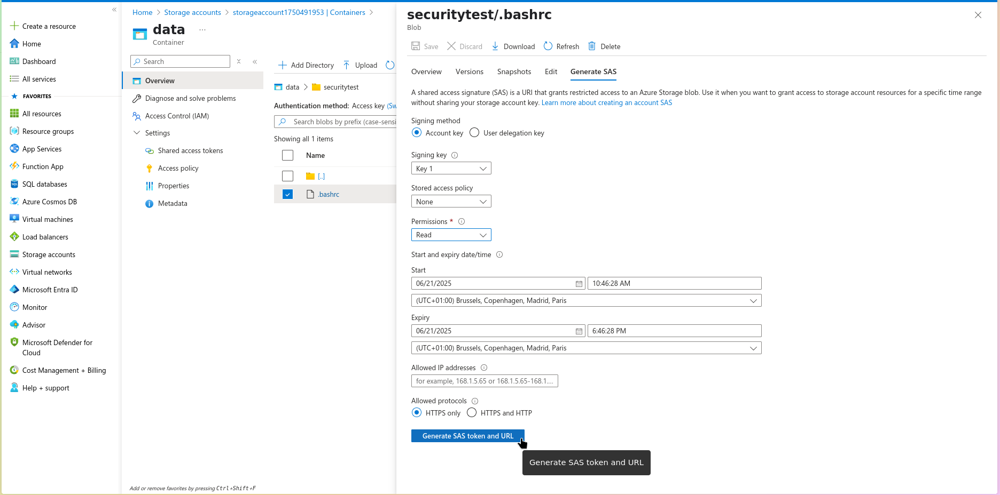

- Click **Generate SAS token and URL**.

- Copy the **Blob SAS URL** entry to the clipboard.

- Open another InPrivate browser window and navigate to the Blob SAS URL you copied in the previous step.

    >**Note**: You should be able to view the content of the file.

### Azure Cloud Shell (Bash)

- Create a blob container:

    ```bash
    # Set variables value
    RESOURCE_GROUP='az104-rg'; STORAGE_ACCOUNT_NAME='storageaccount1750491953'

    # Get storage account key
    STORAGE_KEY=$(az storage account keys list \
      --resource-group $RESOURCE_GROUP \
      --account-name $STORAGE_ACCOUNT_NAME \
      --query '[0].value' -o tsv)
    # Initial attempt to create container (may fail due to network rules)
    az storage container create \
      --name data \
      --account-name $STORAGE_ACCOUNT_NAME \
      --account-key $STORAGE_KEY \
      --public-access off
    ```

    >**Note**: If you encounter the error *"The request may be blocked by network rules of storage account"*, follow these additional steps:

    ```bash
    # Check current network rule configuration
    az storage account show -n $STORAGE_ACCOUNT_NAME --resource-group $RESOURCE_GROUP --query networkRuleSet

    # Get your current public IP
    MY_IP=$(curl -s https://ipinfo.io/ip)

    # Add your IP to the firewall rules
    az storage account network-rule add \
      --resource-group $RESOURCE_GROUP \
      --account-name $STORAGE_ACCOUNT_NAME \
      --ip-address $MY_IP

    # Update default action to Allow (temporarily for lab completion)
    az storage account update \
      --name $STORAGE_ACCOUNT_NAME \
      --resource-group $RESOURCE_GROUP \
      --default-action Allow
    # Verify network rules are updated
    echo "Mi IP es: $MY_IP"
    az storage account network-rule list \
      --resource-group $RESOURCE_GROUP \
      --account-name $STORAGE_ACCOUNT_NAME

    # Now retry creating the container
    az storage container create \
      --name data \
      --account-name $STORAGE_ACCOUNT_NAME \
      --account-key $STORAGE_KEY \
      --public-access off
    ```

    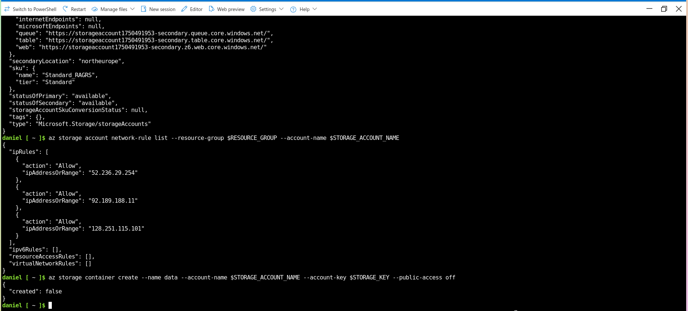

- Verify container creation:

    ```bash
    # List containers to confirm creation
    az storage container list \
      --account-name $STORAGE_ACCOUNT_NAME \
      --account-key $STORAGE_KEY \
      --output table
    ```

- Set immutable blob storage policy:

    ```bash
    # Set time-based retention policy (30 days)
    az storage container immutability-policy create \
      --account-name $STORAGE_ACCOUNT_NAME \
      --container-name data \
      --period 30
    ```
- Upload a file to blob storage:

    ```bash
    # Create a sample file
    echo "Hola mundo!" > testfile2.txt

    # Upload file to specific folder
    az storage blob upload \
      --account-name $STORAGE_ACCOUNT_NAME \
      --account-key $STORAGE_KEY \
      --container-name data \
      --name securitytest/testfile2.txt \
      --file testfile2.txt \
      --tier Hot
    ```

    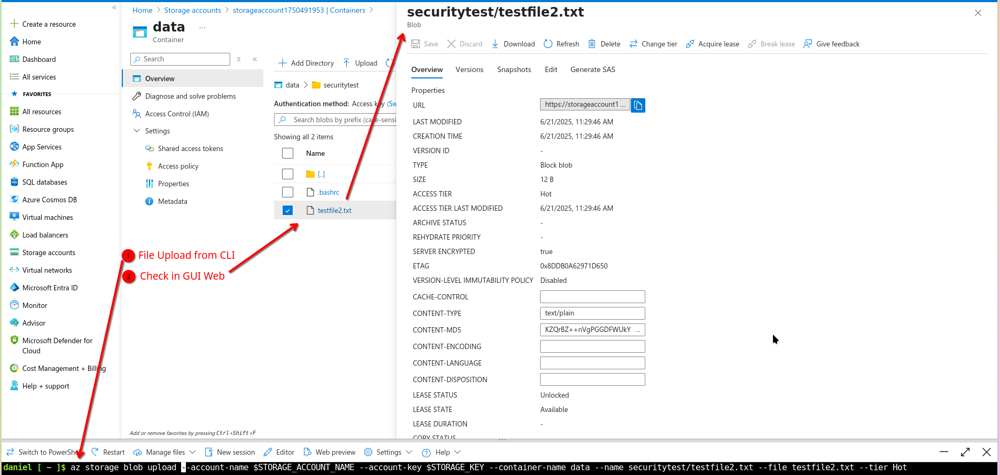

- Generate SAS token for secure access:

    ```bash
    # Generate SAS token for the blob
    SAS_TOKEN=$(az storage blob generate-sas \
      --account-name $STORAGE_ACCOUNT_NAME \
      --account-key $STORAGE_KEY \
      --container-name data \
      --name securitytest/testfile2.txt \
      --permissions r \
      --expiry $(date -d '+1 day' '+%Y-%m-%d') \
      --output tsv)

    # Create full URL with SAS token
    BLOB_URL="https://${STORAGE_ACCOUNT_NAME}.blob.core.windows.net/data/securitytest/testfile2.txt?${SAS_TOKEN}"

    echo "Blob URL with SAS token: $BLOB_URL"
    ```

- Test secure access:

    ```bash
    # Test access with SAS URL (this will show the file content)
    curl "$BLOB_URL"
    ```

    

- Optional - Restore network restrictions after lab completion:

    ```bash
    # Restore more restrictive network access (optional)
    az storage account update \
      --name $STORAGE_ACCOUNT_NAME \
      --resource-group $RESOURCE_GROUP \
      --default-action Deny

    # Remove your IP from firewall if desired
    az storage account network-rule remove \
      --resource-group $RESOURCE_GROUP \
      --account-name $STORAGE_ACCOUNT_NAME \
      --ip-address $MY_IP
    ```

## Task 3: Create and configure an Azure File storage

In this task, you will create and configure Azure File shares. You will use Storage Browser to manage the file share.

### Create the file share and upload a file

- In the Azure portal, navigate back to your storage account, in the **Data storage** blade, click **File shares**.
- Click **+ File share** and on the **Basics** tab give the file share a name, `share1`.
- Notice the **Access tier** options. Keep the default **Transaction optimized**.
- Move to the **Backup** tab and ensure **Enable backup** is **not** checked. We are disabling backup to simplify the lab configuration.
- Click **Review + create**, and then **Create**. Wait for the file share to deploy.

### Explore Storage Browser and upload a file

- Return to your storage account and select **Storage browser**. The Azure Storage Browser is a portal tool that lets you quickly view all the storage services under your account.
- Select **File shares** and verify your **share1** directory is present.
- Select your **share1** directory and notice you can **+ Add directory**. This lets you create a folder structure.
- Select **Upload**. Browse to a file of your choice, and then click **Upload**.

    >**Note**: You can view file shares and manage those shares in the Storage Browser. There are currently no restrictions.

### Azure Cloud Shell (Bash)

- Create Azure File Share:

    ```bash
    # Create file share
    az storage share create \
      --name share1-cli \
      --account-name $STORAGE_ACCOUNT_NAME \
      --account-key $STORAGE_KEY \
      --quota 1024
    ```


- Create a directory in the file share:

    ```bash
    # Create directory
    az storage directory create \
        --name testdir-cli \
        --share-name share1-cli \
        --account-name $STORAGE_ACCOUNT_NAME \
        --account-key $STORAGE_KEY
    ```

- Upload a file to the file share:

    ```bash
    # Create another test file
    echo "This is a test file for Azure File Share - hello world!" > fileshare-test-cli.txt

    # Upload file to file share
    az storage file upload \
      --share-name share1-cli \
      --source fileshare-test-cli.txt \
      --path testdir-cli/fileshare-test-cli.txt \
      --account-name $STORAGE_ACCOUNT_NAME \
      --account-key $STORAGE_KEY
    ```

    

- List files in the file share:

    ```bash
    # List files in directory
    az storage file list \
      --share-name share1-cli \
      --path testdir-cli \
      --account-name $STORAGE_ACCOUNT_NAME \
      --account-key $STORAGE_KEY \
      --output table
    ```

    

### Restrict network access to the storage account

- In the portal, search for and select **Virtual networks**.
- Select **+ Create**. Select your resource group. and give the virtual network a **name**, `vnet1`.
- Take the defaults for other parameters, select **Review + create**, and then **Create**.
- Wait for the virtual network to deploy, and then select **Go to resource**.
- In the **Settings** section, select the **Service endpoints** blade.

    - Select **Add**.
    - In the **Services** drop-down select **Microsoft.Storage**.
    - In the **Subnets** drop-down check the **Default** subnet.
    - Click **Add** to save your changes.

- Return to your storage account.
- In the **Security + networking** blade, select **Networking**.
- Select **Add existing virtual network** and select **vnet1** and **default** subnet, select **Add**.
- In the **Firewall** section, **Delete** your machine IP address. Allowed traffic should only come from the virtual network.
- Be sure to **Save** your changes.

    >**Note:** The storage account should now only be accessed from the virtual network you just created.

- Select the **Storage browser** and **Refresh** the page. Navigate to your file share or blob content.

    >**Note:** You should receive a message *not authorized to perform this operation*. You are not connecting from the virtual network. It may take a couple of minutes for this to take effect.

### Azure Cloud Shell (Bash) - Network Configuration

- Create virtual network:

    ```bash
    # Create virtual network
    az network vnet create \
      --resource-group $RESOURCE_GROUP \
      --name vnet1 \
     --address-prefix 10.0.0.0/16 \
      --subnet-name default \
      --subnet-prefix 10.0.0.0/24 \
      --location $LOCATION
    ```

    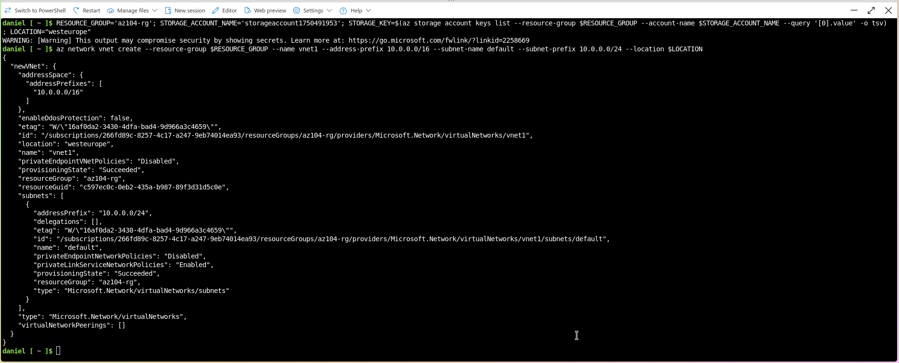

- Create service endpoint:

    ```bash
    # Add service endpoint to subnet
    az network vnet subnet update \
      --resource-group $RESOURCE_GROUP \
      --vnet-name vnet1 \
      --name default \
      --service-endpoints Microsoft.Storage
    ```

- Configure storage account network rules:

    ```bash
    # Remove current IP from firewall
    az storage account network-rule remove \
      --resource-group $RESOURCE_GROUP \
     --account-name $STORAGE_ACCOUNT_NAME \
      --ip-address $MY_IP

    # Add virtual network rule
    az storage account network-rule add \
      --resource-group $RESOURCE_GROUP \
      --account-name $STORAGE_ACCOUNT_NAME \
      --vnet-name vnet1 \
      --subnet default
    ```

    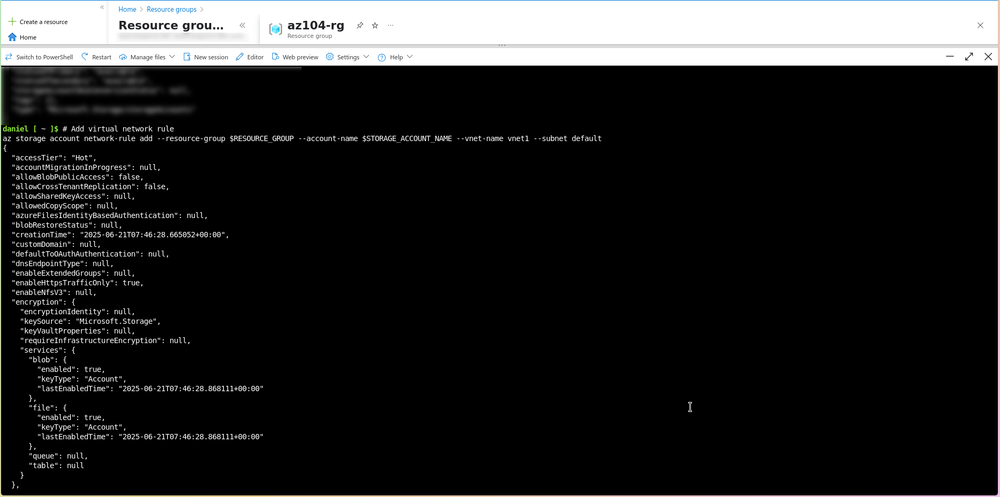

- Verify network access is restricted:

    ```bash
    # Try to list containers (should fail)
    az storage container list \
      --account-name $STORAGE_ACCOUNT_NAME \
      --account-key $STORAGE_KEY
    ```

    

## Cleanup your resources

If you are working with **your own subscription** take a minute to delete the lab resources. This will ensure resources are freed up and cost is minimized. The easiest way to delete the lab resources is to delete the lab resource group.

### Azure Cloud Shell (Bash)

```bash
# Delete resource group (this will delete all resources in the group)
az group delete --name $RESOURCE_GROUP --yes --no-wait
```


### Extra

```bash
# Delete resource group (this will delete all resources in the group)
az group delete --name $RESOURCE_GROUP --yes
```


## Extend your learning with Copilot
Copilot can assist you in learning how to use the Azure scripting tools. Copilot can also assist in areas not covered in the lab or where you need more information. Open an Edge browser and choose Copilot (top right) or navigate to *copilot.microsoft.com*. Take a few minutes to try these prompts.

- Provide an Azure PowerShell script to create a storage account with a blob container.
- Provide a checklist I can use to ensure my Azure storage account is secure.
- Create a table to compare Azure storage redundancy models.

<!-- [Copilot Learning](../../images/copilot-learning.png) -->

## Learn more with self-paced training

- [Optimize your cost with Azure Blob Storage](https://learn.microsoft.com/training/modules/optimize-your-cost-azure-blob-storage/). Learn how to optimize your cost with Azure Blob Storage.
- [Control access to Azure Storage with shared access signatures](https://learn.microsoft.com/training/modules/control-access-to-azure-storage-with-sas/). Grant access to data stored in your Azure Storage accounts securely by using shared access signatures.

## Key takeaways

<!--  -->

Congratulations on completing the lab. Here are the main takeaways for this lab.

- An Azure storage account contains all your Azure Storage data objects: blobs, files, queues, and tables. The storage account provides a unique namespace for your Azure Storage data that is accessible from anywhere in the world over HTTP or HTTPS.
- Azure storage provides several redundancy models including Locally redundant storage (LRS), Zone-redundant storage (ZRS), and Geo-redundant storage (GRS).
- Azure blob storage allows you to store large amounts of unstructured data on Microsoft's data storage platform. Blob stands for Binary Large Object, which includes objects such as images and multimedia files.
- Azure file Storage provides shared storage for structured data. The data can be organized in folders.
- Immutable storage provides the capability to store data in a write once, read many (WORM) state. Immutable storage policies can be time-based or legal-hold.

## Additional Azure CLI Commands Reference

Here are some additional useful Azure CLI commands for managing storage accounts:

### Command multiples

```bash
# Subscription list
az account list --output table
#
az account set --subscription "<SUBSCRIPTION_NAME> | (or) <SUBSCRIPTION_ID>"

#
RESOURCE_GROUP='<NAME_RESOURCE_GROUP>'; STORAGE_ACCOUNT_NAME='<NAME_STORAGE_ACCOUNT_NAME>'; STORAGE_KEY=$(az storage account keys list --resource-group $RESOURCE_GROUP --account-name $STORAGE_ACCOUNT_NAME --query '[0].value' -o tsv)
LOCATION="westeurope"

```

### Storage Account Management

```bash
# List all storage accounts
az storage account list --output table

# Show storage account details
az storage account show --name $STORAGE_ACCOUNT_NAME --resource-group $RESOURCE_GROUP

# Get storage account keys
az storage account keys list --account-name $STORAGE_ACCOUNT_NAME --resource-group $RESOURCE_GROUP

# Regenerate storage account key
az storage account keys renew --account-name $STORAGE_ACCOUNT_NAME --resource-group $RESOURCE_GROUP --key key1
```

### Blob Management

```bash
# List all containers
az storage container list --account-name $STORAGE_ACCOUNT_NAME --account-key $STORAGE_KEY --output table

# List blobs in container
az storage blob list --container-name data --account-name $STORAGE_ACCOUNT_NAME --account-key $STORAGE_KEY --output table

# Download blob
az storage blob download --container-name data --name securitytest/testfile.txt --file downloaded-file.txt --account-name $STORAGE_ACCOUNT_NAME --account-key $STORAGE_KEY

# Delete blob
az storage blob delete --container-name data --name securitytest/testfile.txt --account-name $STORAGE_ACCOUNT_NAME --account-key $STORAGE_KEY
```

### File Share Management

```bash
# List file shares
az storage share list --account-name $STORAGE_ACCOUNT_NAME --account-key $STORAGE_KEY --output table

# Download file from share
az storage file download --share-name share1 --path testdir/fileshare-test.txt --dest downloaded-share-file.txt --account-name $STORAGE_ACCOUNT_NAME --account-key $STORAGE_KEY

# Delete file from share
az storage file delete --share-name share1 --path testdir/fileshare-test.txt --account-name $STORAGE_ACCOUNT_NAME --account-key $STORAGE_KEY
```

<!--  -->
