# Lab 02b - Manage Governance via Azure Policy - Complete Guide

## Lab Overview
**Author:** Daniel Oscar Zamo  
**Estimated Time:** 30 minutes  
**Module:** Administer Governance and Compliance  

## Architecture Overview


---

## Task 1: Create and assign tags via the Azure portal

### Web Interface Navigation:

1. **Access Azure Portal**
   - Navigate to `https://portal.azure.com`
   - Sign in with your Azure credentials

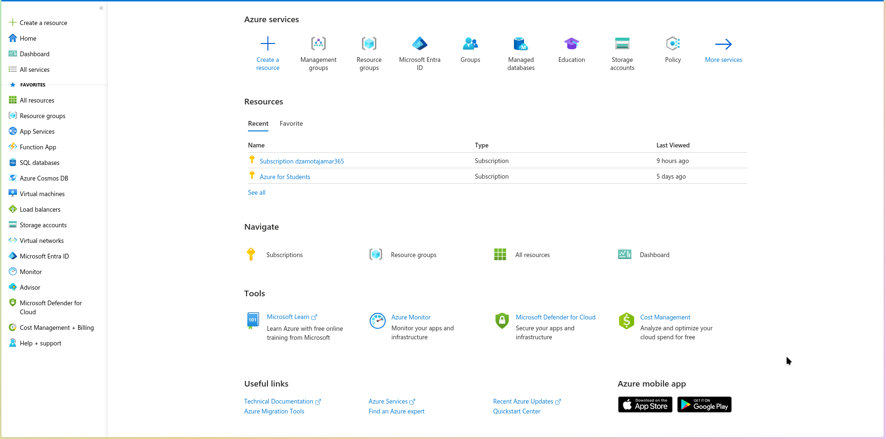

2. **Search for Resource Groups**
   - In the top search bar, type "Resource groups"
   - Click on the "Resource groups" service in the results

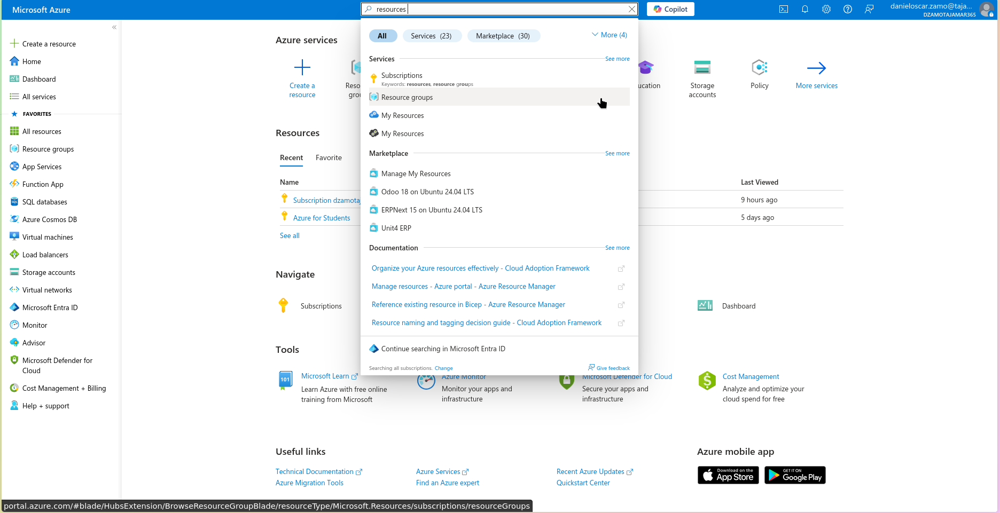

3. **Create new Resource Group**
   - Click the **"+ Create"** button in the top toolbar
   - Fill out the **Basics** tab:
     - **Subscription**: Select your subscription
     - **Resource group name**: `az104-rg2`
     - **Region**: `East US`


4. **Configure Tags**
   - Click **"Next: Tags"** to move to the Tags tab
   - Add the required tag:
     - **Name**: `Cost Center`
     - **Value**: `000`

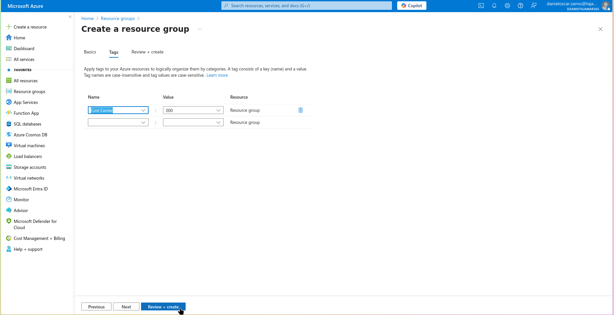

5. **Review and Create**
   - Click **"Review + Create"** to validate the configuration
   - Review all settings and click **"Create"**

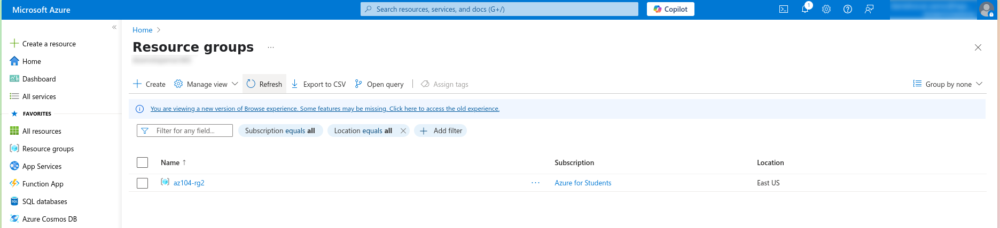

### Alternative CLI Command:

```bash
# Create resource group with Cost Center tag
az group create \
  --name az104-rg2 \
  --location eastus \
  --tags "Cost Center=000"

# Verify the resource group was created with tags
az group show --name az104-rg2 --query "{Name:name,Location:location,Tags:tags}" --output table
```

---

## Task 2: Enforce tagging via an Azure Policy

### Web Interface Navigation:

1. **Access Azure Policy**
   - In the search bar, type "Policy"
   - Select "Policy" from the search results

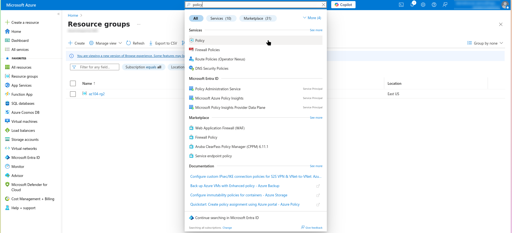

2. **Browse Policy Definitions**
   - In the left panel, under **Authoring**, click **"Definitions"**
   - Browse through the built-in policy definitions
   - Search for "Require a tag and its value on resources"

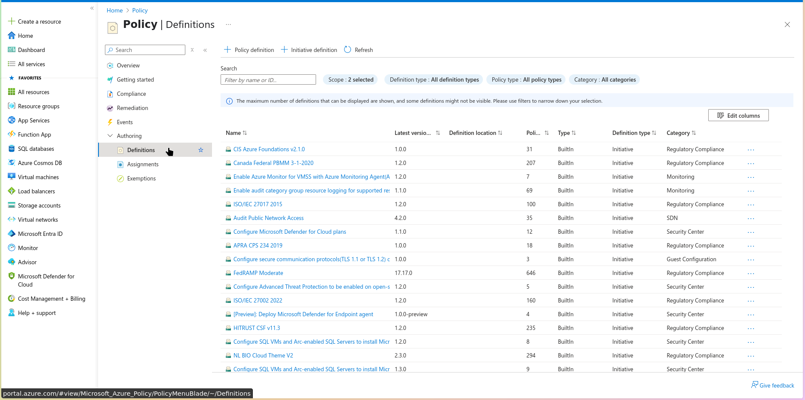

3. **Select Policy Definition**
   - Click on **"Require a tag and its value on resources"** policy
   - Review the policy definition details
   - Click **"Assign"** to start the assignment process

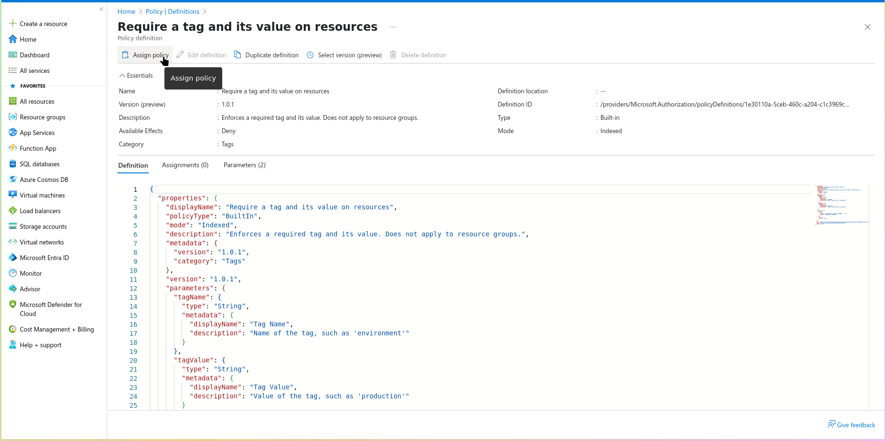

4. **Configure Scope**
   - Click the ellipsis (**...**) button next to Scope
   - Select your subscription
   - Select **az104-rg2** resource group
   - Click **"Select"**

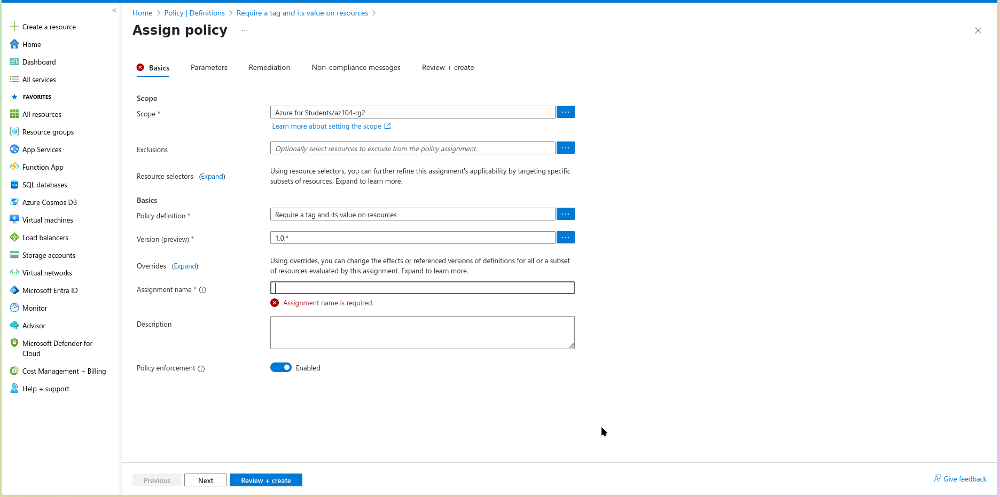

5. **Configure Assignment Basics**
   - **Assignment name**: `Require Cost Center tag and its value on resources`
   - **Description**: `Require Cost Center tag and its value on all resources in the resource group`
   - **Policy enforcement**: `Enabled`

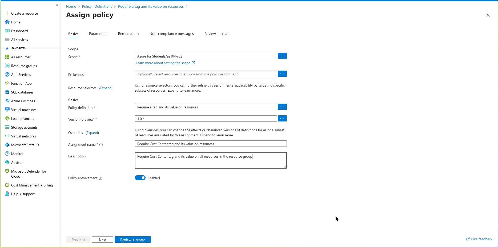

6. **Configure Parameters**
   - Click **"Next"** to go to Parameters tab
   - Set the following parameters:
     - **Tag Name**: `Cost Center`
     - **Tag Value**: `000`

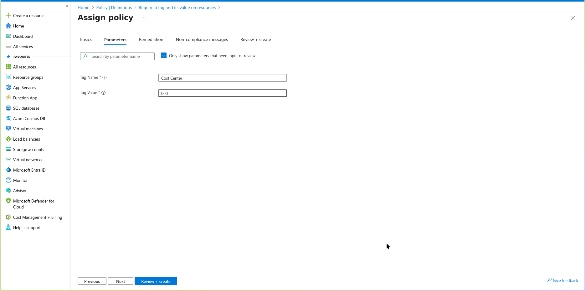

7. **Review Remediation**
   - Click **"Next"** to go to Remediation tab
   - Leave **"Create a Managed Identity"** unchecked for this policy
   - Click **"Review + Create"** and then **"Create"**

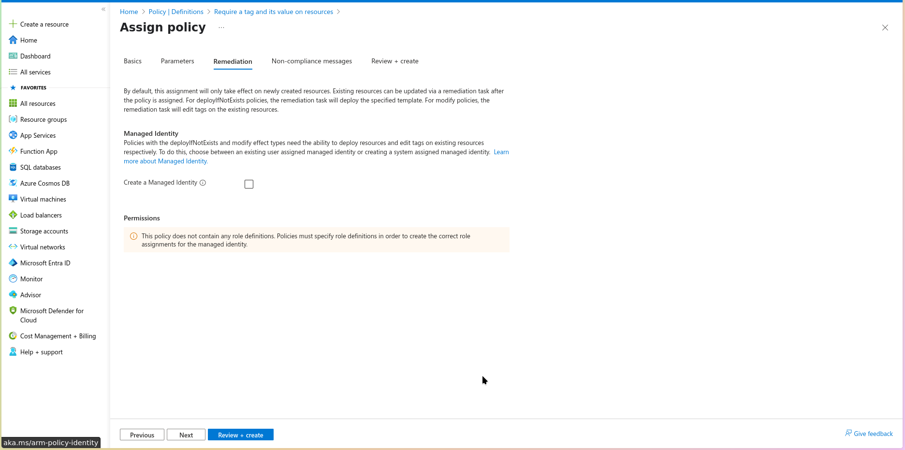

8. **Test Policy Enforcement**
   - Wait 5-10 minutes for policy to take effect
   - Search for "Storage Account" and click **"+ Create"**
   - Configure basic settings:
     - **Resource group**: `az104-rg2`
     - **Storage account name**: Enter a unique name (3-24 characters, lowercase letters and numbers)
   - Click **"Review"** then **"Create"**

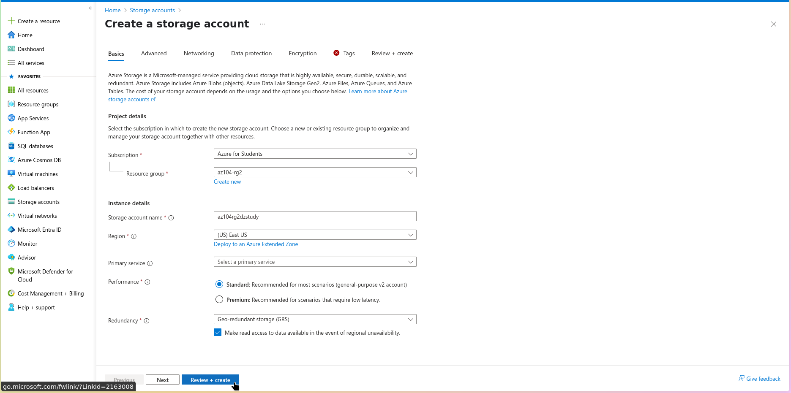

9. **Verify Policy Enforcement**
   - You should receive a **"Validation failed"** message
   - Click on **"Raw Error"** tab to see detailed error information
   - The error should indicate that the policy prevented deployment due to missing required tag

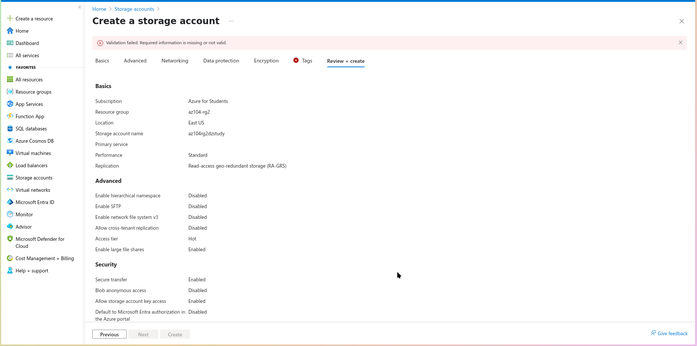

### Alternative CLI Commands:

```bash
# Find the policy definition ID
az policy definition list --query "[?displayName=='Require a tag and its value on resources'].{Name:name,DisplayName:displayName}" --output table

# Assign the policy to the resource group
az policy assignment create \
  --name "Require-CostCenter-Tag" \
  --display-name "Require Cost Center tag and its value on resources" \
  --policy "/providers/Microsoft.Authorization/policyDefinitions/1e30110a-5ceb-460c-a204-c1c3969c6d62" \
  --scope "/subscriptions/$(az account show --query id -o tsv)/resourceGroups/az104-rg2" \
  --params '{"tagName":{"value":"Cost Center"},"tagValue":{"value":"000"}}'

# Test policy by trying to create storage account without tag (should fail)
az storage account create \
  --name teststorage$(date +%s) \
  --resource-group az104-rg2 \
  --location eastus \
  --sku Standard_LRS
```

---

## Task 3: Apply tagging via an Azure Policy (Remediation)

### Web Interface Navigation:

1. **Delete Previous Policy Assignment**
   - Go to **Policy** → **Assignments**
   - Find the **"Require Cost Center tag with Default value"** assignment
   - Click the ellipsis (**...**) and select **"Delete assignment"**

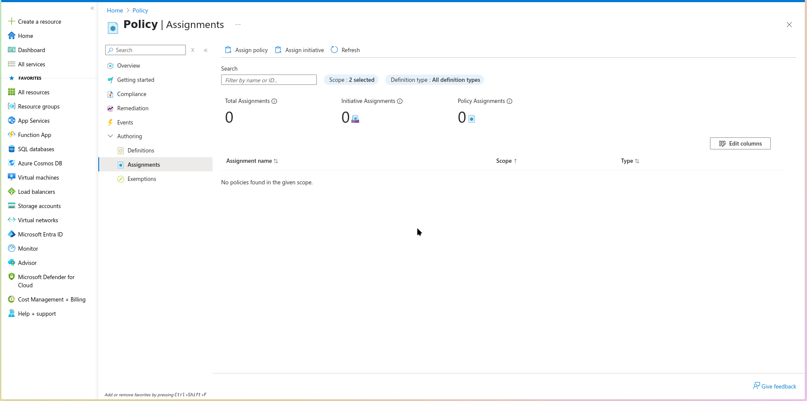

2. **Create New Remediation Policy**
   - Click **"Assign policy"** 
   - Configure the scope (same as before):
     - **Subscription**: Your subscription
     - **Resource Group**: `az104-rg2`

3. **Select Inheritance Policy**
   - Click ellipsis (**...**) next to Policy definition
   - Search for "Inherit a tag from the resource group if missing"
   - Select this policy and click **"Add"**


4. **Configure Assignment Details**
   - **Assignment name**: `Inherit the Cost Center tag and its value 000 from the resource group if missing`
   - **Description**: `Inherit the Cost Center tag and its value 000 from the resource group if missing`
   - **Policy enforcement**: `Enabled`

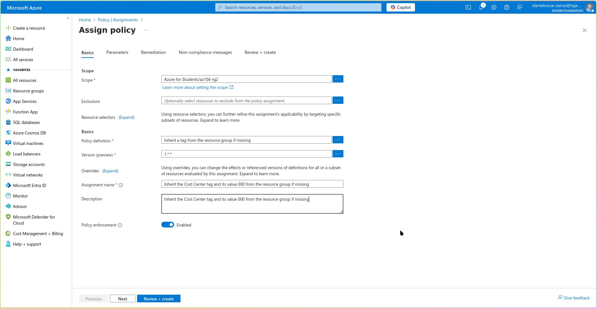

5. **Set Parameters**
   - Click **"Next"** twice to reach Parameters tab
   - **Tag Name**: `Cost Center`

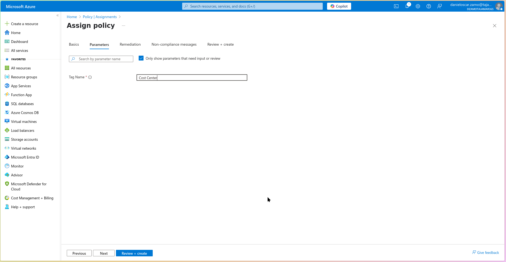

6. **Configure Remediation**
   - Go to **Remediation** tab
   - Check **"Create a remediation task"**
   - **Policy to remediate**: Should auto-select the inheritance policy
   - Click **"Review + Create"** then **"Create"**

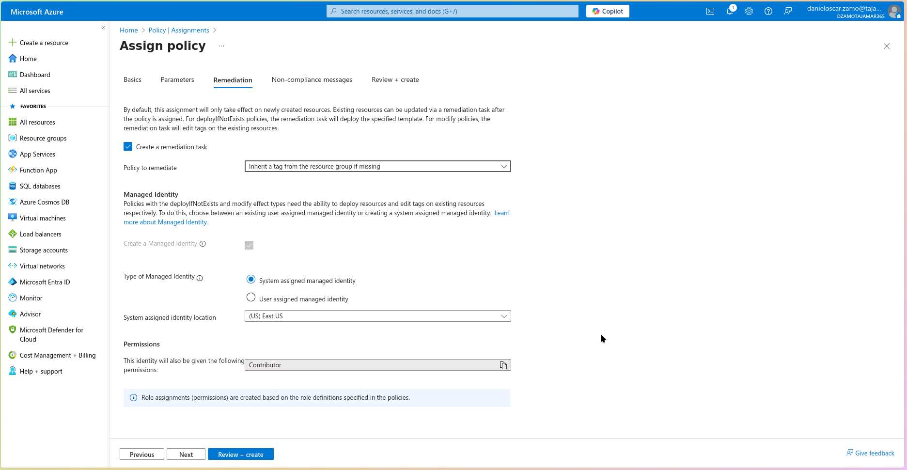

7. **Test the New Policy**
   - Wait 5-10 minutes for policy to take effect
   - Create a new Storage Account in **az104-rg2**
   - **Do not** add any tags manually
   - Complete creation process

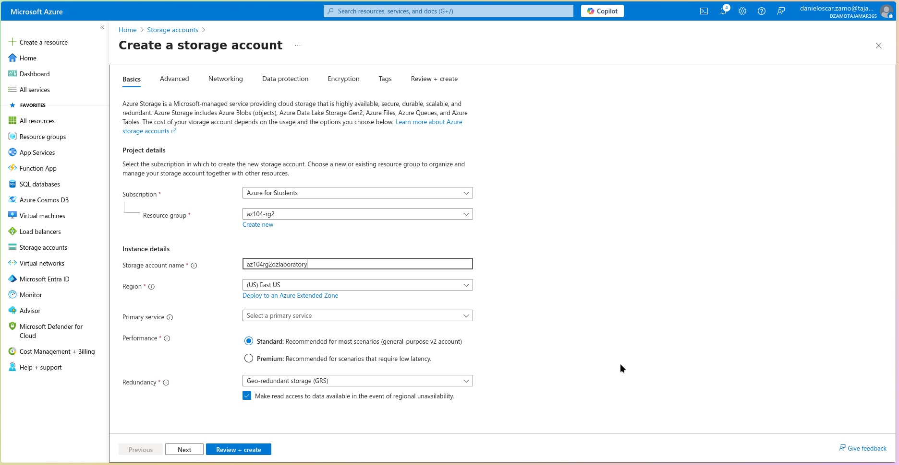

8. **Verify Tag Inheritance**
   - After storage account is created, click **"Go to resource"**
   - Navigate to **"Tags"** blade
   - Verify that **Cost Center: 000** tag was automatically applied

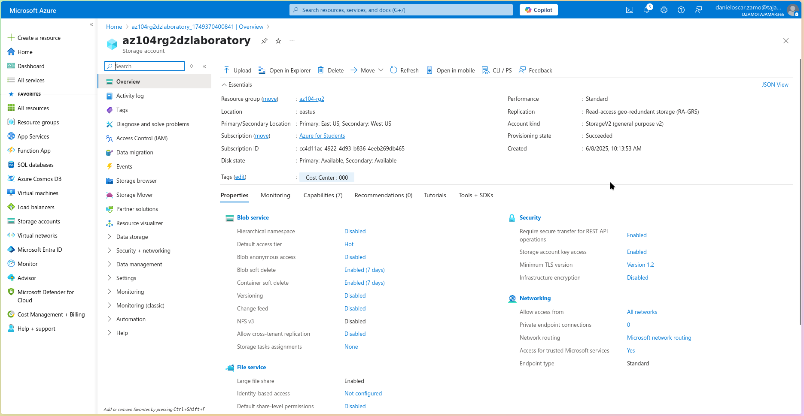

### Alternative CLI Commands:

```bash
# Delete the previous policy assignment
az policy assignment delete --name "Require-CostCenter-Tag" --resource-group az104-rg2

# Create the inheritance policy assignment
az policy assignment create \
  --name "Inherit-CostCenter-Tag" \
  --display-name "Inherit the Cost Center tag and its value 000 from the resource group if missing" \
  --policy "/providers/Microsoft.Authorization/policyDefinitions/ea3f2387-9b95-492a-a190-fcdc54f7b070" \
  --scope "/subscriptions/$(az account show --query id -o tsv)/resourceGroups/az104-rg2" \
  --params '{"tagName":{"value":"Cost Center"}}' \
  --identity-scope "/subscriptions/$(az account show --query id -o tsv)/resourceGroups/az104-rg2" \
  --location eastus

# Create remediation task
az policy remediation create \
  --name "remediate-cost-center-inheritance" \
  --policy-assignment "Inherit-CostCenter-Tag" \
  --resource-group az104-rg2

# Test by creating storage account without explicit tags
az storage account create \
  --name teststorage$(date +%s) \
  --resource-group az104-rg2 \
  --location eastus \
  --sku Standard_LRS

# Check if tag was inherited
az storage account list --resource-group az104-rg2 --query "[].{Name:name,Tags:tags}" --output table
```

---

## Task 4: Configure and test resource locks

### Web Interface Navigation:

1. **Access Resource Group**
   - Navigate to **Resource groups**
   - Select **az104-rg2**

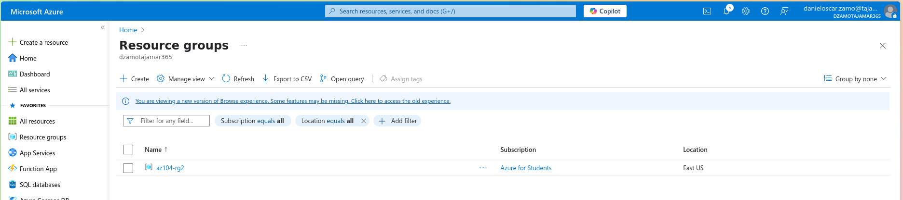

2. **Configure Resource Lock**
   - In the left panel under **Settings**, click **"Locks"**
   - Click **"+ Add"** to create a new lock

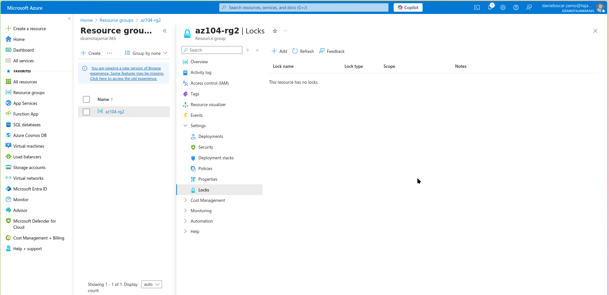

3. **Create the Lock**
   - **Lock name**: `rg-lock`
   - **Lock type**: Select **"Delete"** (prevents deletion)
   - **Notes**: Optional description
   - Click **"OK"**

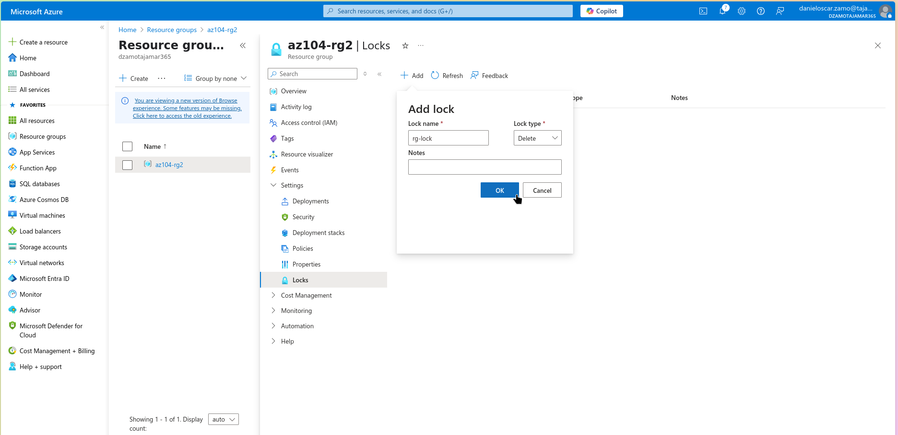

4. **Test the Lock**
   - Go to the resource group **Overview** page
   - Click **"Delete resource group"**
   - Enter the resource group name `az104-rg2` to confirm
   - Click **"Delete"**

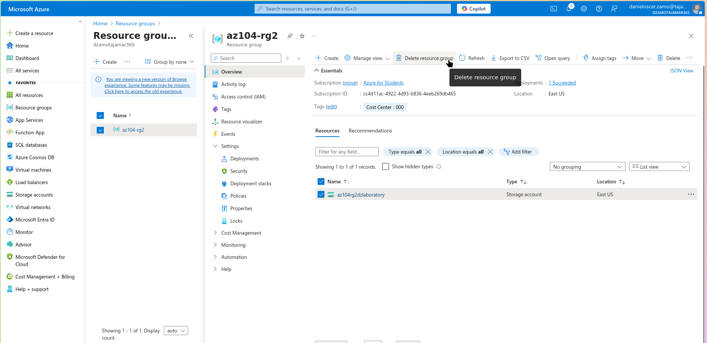

5. **Verify Lock Protection**
   - You should receive a notification that the deletion was denied
   - The lock successfully prevented the resource group deletion

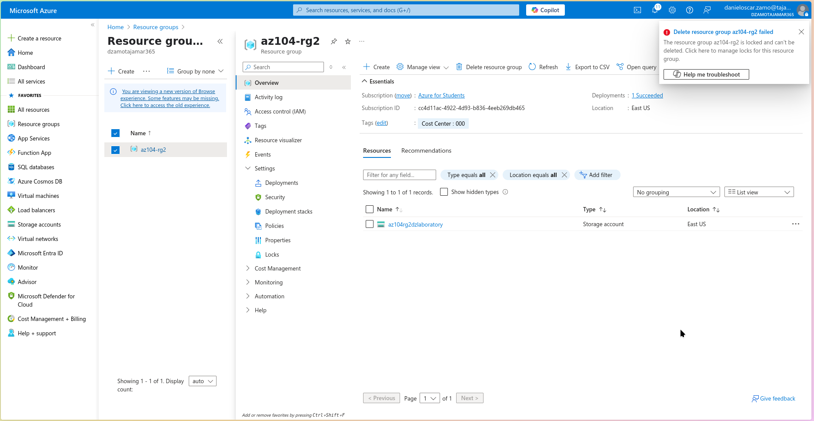

### Alternative CLI Commands:

```bash
# Create a delete lock on the resource group
az lock create \
  --name rg-lock \
  --lock-type CanNotDelete \
  --resource-group az104-rg2 \
  --notes "Prevents accidental deletion of resource group"

# List all locks in the resource group
az lock list --resource-group az104-rg2 --output table

# Test deletion (should fail due to lock)
az group delete --name az104-rg2 --yes --no-wait

# Verify resource group still exists
az group show --name az104-rg2 --query name --output tsv

# To remove the lock (if needed for cleanup)
az lock delete --name rg-lock --resource-group az104-rg2
```

---

## Lab Verification and Monitoring

### Check Policy Compliance:

```bash
# View policy compliance status
az policy state list --resource-group az104-rg2 --query "[].{Resource:resourceId,Compliance:complianceState,Policy:policyDefinitionName}" --output table

# Check remediation task status
az policy remediation list --resource-group az104-rg2 --output table

# View all resources with Cost Center tag
az resource list --tag "Cost Center=000" --query "[].{Name:name,Type:type,ResourceGroup:resourceGroup}" --output table
```

### Complete Lab Cleanup:

```bash
# Remove the resource lock first
az lock delete --name rg-lock --resource-group az104-rg2

# Remove policy assignments
az policy assignment delete --name "Inherit-CostCenter-Tag" --resource-group az104-rg2

# Delete the resource group and all resources
az group delete --name az104-rg2 --yes --no-wait
```

---

## Key Screenshots Required

1. **Azure Portal Login**: Main portal interface
2. **Resource Group Creation**: Step-by-step wizard
3. **Tags Configuration**: Tags tab with Cost Center tag
4. **Policy Definitions**: Browse built-in policies
5. **Policy Assignment**: Configuration and parameters
6. **Policy Enforcement Error**: Validation failure message
7. **Inheritance Policy**: Selection and configuration
8. **Tag Inheritance Verification**: Automatic tag application
9. **Resource Lock Creation**: Lock configuration
10. **Lock Protection**: Deletion denial notification

---

## Learning Extensions with Copilot

Try these prompts with Microsoft Copilot:

- "What are the Azure PowerShell and CLI commands for adding and deleting resource locks on a resource group?"
- "Tabulate the differences between Azure policy and Azure RBAC, include examples."
- "What are the steps to enforce Azure policy and remediate resources which are not compliant?"
- "How can I get a report of Azure resources with specific tags?"

---

## Key Takeaways

1. **Azure Tags**: Metadata key-value pairs for resource organization and reporting
2. **Azure Policy**: Establishes and enforces resource compliance conventions
3. **Policy Effects**: Deny, Audit, Modify, DeployIfNotExists for different scenarios
4. **Remediation**: Automated compliance correction for existing resources
5. **Resource Locks**: Protection against accidental deletion or modification
6. **Governance Strategy**: Combination of tags, policies, and locks for comprehensive resource management

This comprehensive guide provides both visual navigation and CLI alternatives for complete Azure governance implementation.