# Lab 03 - Manage Azure resources by using Azure Resource Manager Templates - Complete Solution

## Lab Overview
**Estimated Time:** 50 minutes  
**Objective:** Learn to automate resource deployments using Azure Resource Manager templates and Bicep templates

## Prerequisites
- Azure subscription
- Access to Azure Portal
- Basic understanding of JSON and Azure resources

---

## Task 1: Create an Azure Resource Manager Template

### Step-by-step Navigation:

1. **Access Azure Portal**
   - Navigate to `https://portal.azure.com`
   - Sign in with your Azure credentials
   
   

2. **Navigate to Disks Service**
   - In the search bar at the top, type "Disks"
   - Select **Disks** from the search results
   
   

3. **Create New Managed Disk**
   - On the Disks page, click **+ Create**
   
   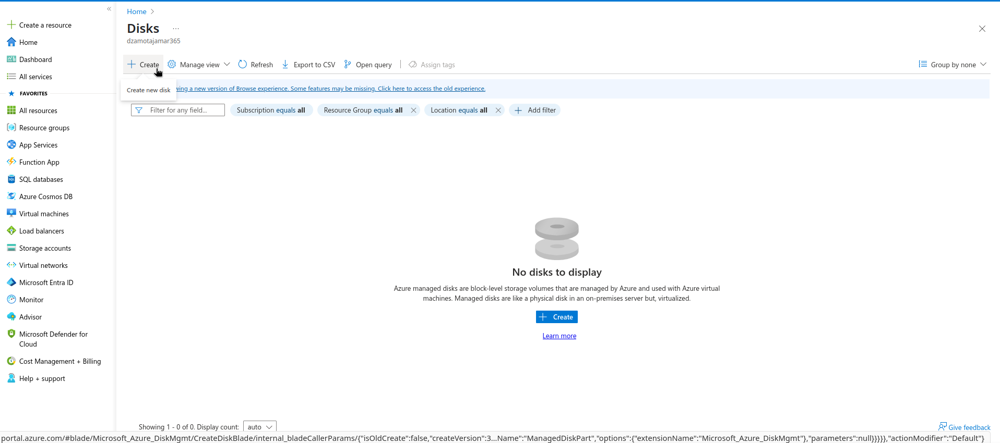

4. **Configure Managed Disk Settings**
   - Fill in the following configuration:
   
   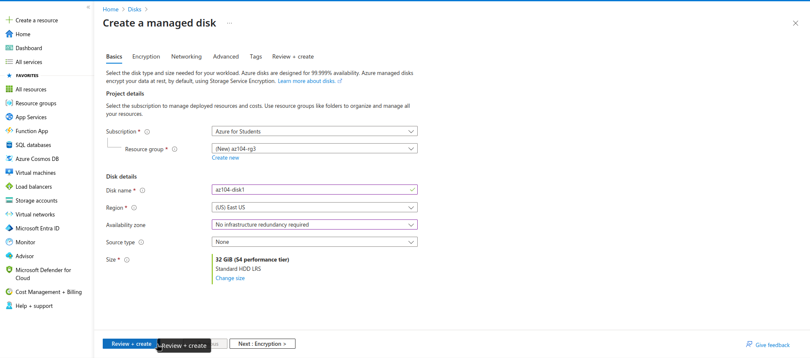
   
   | Setting | Value |
   |---------|-------|
   | Subscription | Select your subscription |
   | Resource Group | `az104-rg3` (Create new if needed) |
   | Disk name | `az104-disk1` |
   | Region | `East US` |
   | Availability zone | `No infrastructure redundancy required` |
   | Source type | `None (empty disk)` |
   | Performance | `Standard HDD` |
   | Size | `32 GiB` |

5. **Deploy the Disk**
   - Click **Review + Create**
   
   
   
   - Verify configuration and click **Create**
   
   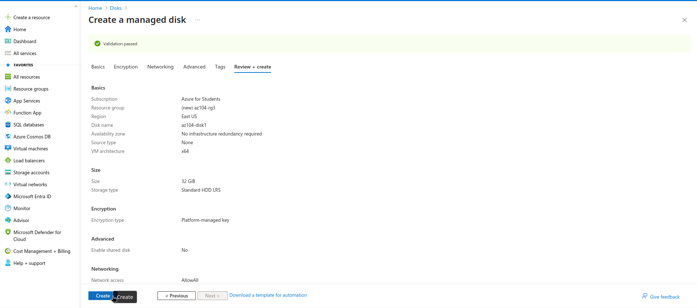

6. **Monitor Deployment**
   - Watch the notification bell (upper right) for deployment status
   - Once completed, click **Go to resource**
   
   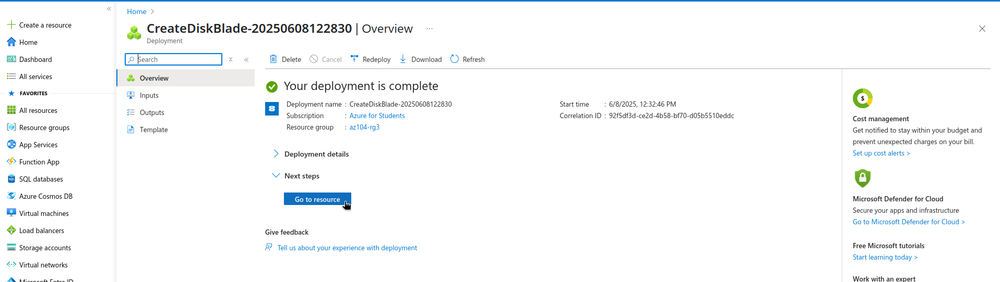

7. **Export ARM Template**
   - In the disk resource page, navigate to **Automation** section
   - Click **Export template**
   
   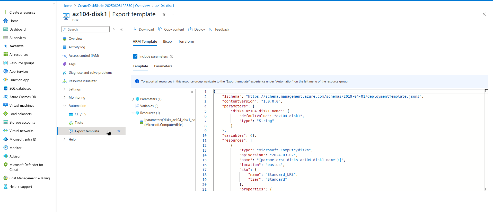

8. **Review Template Components**
   - Examine the **Template** tab (JSON structure)
   - Review the **Parameters** tab (configurable values)
   
   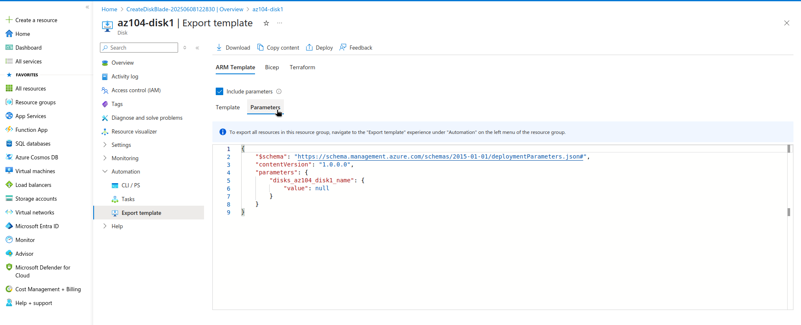

9. **Download Template**
   - Click **Download** to save the template files
   - Extract the ZIP file to your Downloads folder
   - Verify you have both `template.json` and `parameters.json`
   
   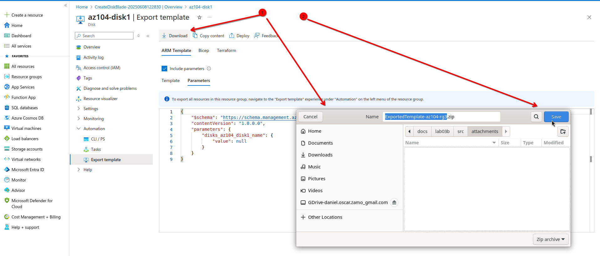

---

## Task 2: Edit an Azure Resource Manager Template and Redeploy

### Step-by-step Navigation:

1. **Access Template Deployment**
   - In Azure Portal, search for "Deploy a custom template"
   - Select **Deploy a custom template**
   
   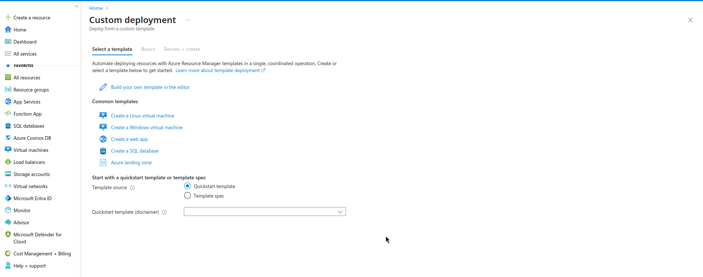

2. **Load Your Template**
   - Click **Build your own template in the editor**
   - Click **Load file** and select your downloaded `template.json`
   
   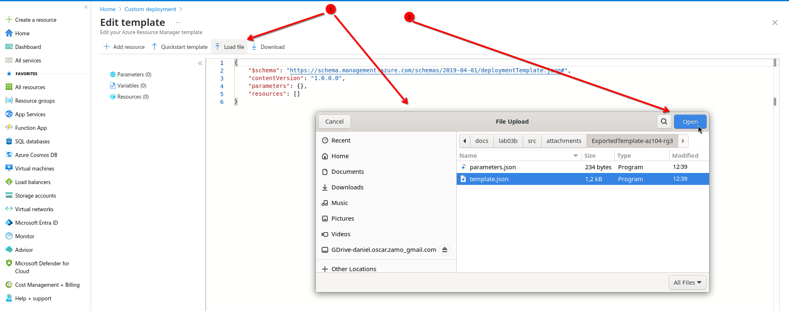

3. **Edit Template Parameters**
   - Modify the disk name in the template:
     ```json
     "diskName": {
       "defaultValue": "az104-disk2",
       "type": "String"
     }
     ```
   
   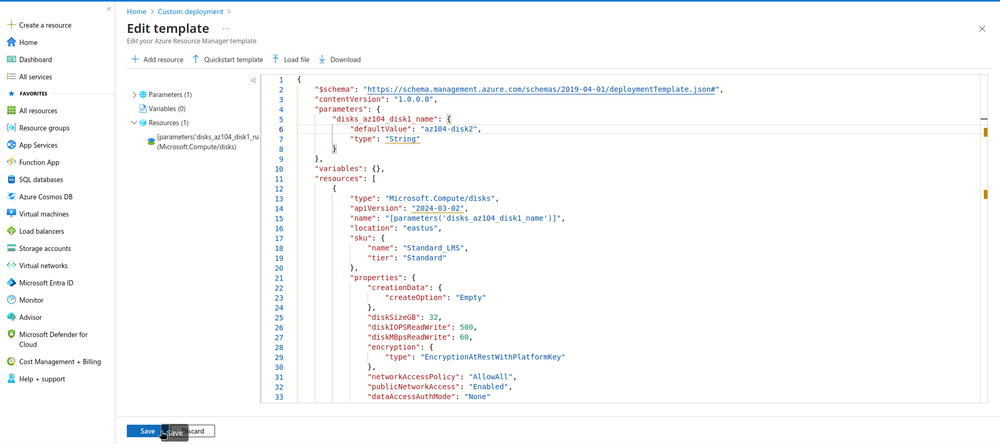

4. **Configure Deployment Parameters**
   - Resource Group: `az104-rg3`
   - Disk Name: `az104-disk2`
   - Location: `East US`
   
   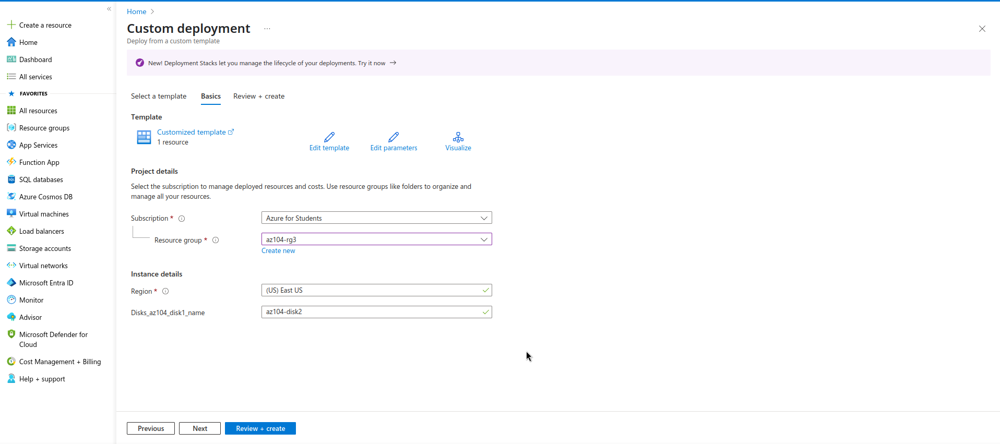

5. **Deploy Modified Template**
   - Click **Review + Create**
   - Click **Create** to deploy the second disk
   
   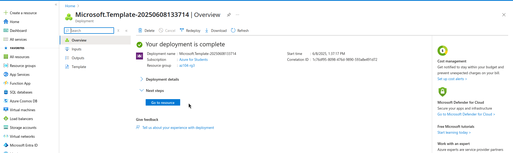

---

## Task 3: Configure Cloud Shell and Deploy Template with PowerShell

### Step-by-step Navigation:

1. **Open Azure Cloud Shell**
   - Click the Cloud Shell icon in the Azure Portal toolbar
   - Select **PowerShell** environment
   
   

2. **Configure Storage (if first time)**
   - If prompted, create storage for Cloud Shell
   - Select your subscription and create storage account
   
   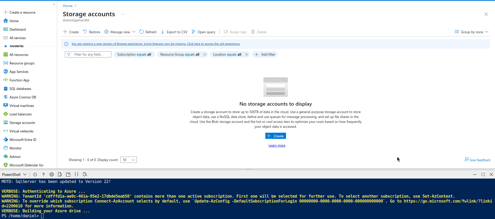

3. **Upload Template Files**
   - Click **Upload/Download files** icon
   - Upload both `template.json` and `parameters.json`
   
   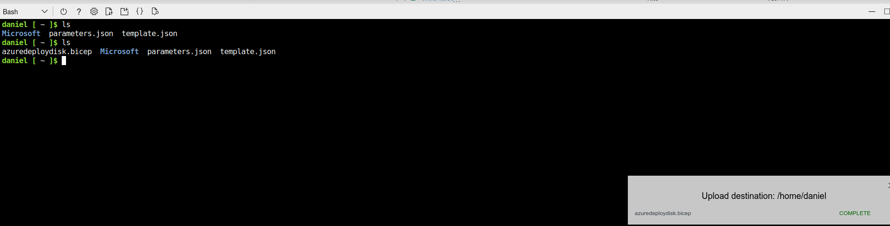

4. **Deploy Using PowerShell Commands**
   ```powershell
   # Verify current context
   Get-AzContext
   
   # Set variables
   $resourceGroupName = "az104-rg3"
   $templateFile = "template.json"
   $parametersFile = "parameters.json"
   
   # Create new deployment with modified disk name
   $deployment = New-AzResourceGroupDeployment `
     -ResourceGroupName $resourceGroupName `
     -TemplateFile $templateFile `
     -diskName "az104-disk3" `
     -location "East US"
   
   # Check deployment status
   $deployment
   ```
   
   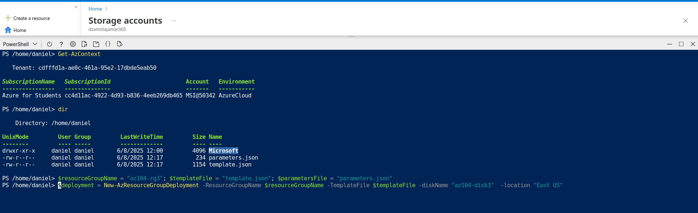

5. **Verify Deployment**
   ```powershell
   # List all disks in resource group
   Get-AzDisk -ResourceGroupName $resourceGroupName
   ```
   
   

---

## Task 4: Deploy Template with Azure CLI

### Step-by-step Navigation:

1. **Switch to Bash in Cloud Shell**
   - In Cloud Shell, click the dropdown and select **Bash**
   
   

2. **Verify Files and Context**
   ```bash
   # List files
   ls -la
   
   # Check current account
   az account show
   ```
   
   

3. **Deploy Template Using Azure CLI**
   ```bash
   # Set variables
   RESOURCE_GROUP="az104-rg3"
   TEMPLATE_FILE="template.json"
   DISK_NAME="az104-disk4"
   LOCATION="eastus"
   
   # Deploy template
   az deployment group create \
     --resource-group $RESOURCE_GROUP \
     --template-file $TEMPLATE_FILE \
     --parameters diskName=$DISK_NAME location=$LOCATION
   ```
   
   

4. **Verify CLI Deployment**
   ```bash
   # List all disks in resource group
   az disk list --resource-group $RESOURCE_GROUP --output table
   ```
   
   

---

## Task 5: Deploy Resource Using Azure Bicep

### Step-by-step Navigation:

1. **Create Bicep Template**
   - In Cloud Shell (Bash), create a new Bicep file:
   ```bash
   # Create Bicep template
   cat > disk.bicep << 'EOF'
   @description('Name of the managed disk')
   param diskName string = 'az104-disk5'
   
   @description('Location for the disk')
   param location string = resourceGroup().location
   
   @description('Disk size in GB')
   param diskSizeGB int = 32
   
   resource managedDisk 'Microsoft.Compute/disks@2023-01-02' = {
     name: diskName
     location: location
     sku: {
       name: 'Standard_LRS'
     }
     properties: {
       creationData: {
         createOption: 'Empty'
       }
       diskSizeGB: diskSizeGB
     }
   }
   
   output diskId string = managedDisk.id
   EOF
   ```
   
   

2. **Deploy Bicep Template**
   ```bash
   # Deploy Bicep template
   az deployment group create \
     --resource-group az104-rg3 \
     --template-file disk.bicep \
     --parameters diskName=az104-disk5
   ```
   
   

3. **Verify Bicep Deployment**
   ```bash
   # Verify all disks created
   az disk list --resource-group az104-rg3 --output table
   ```
   
   

---

## Lab Verification and Cleanup

### Verify All Resources Created:

1. **Portal Verification**
   - Navigate to Resource Group `az104-rg3`
   - Verify all 5 disks are present:
     - az104-disk1 (Manual creation)
     - az104-disk2 (Template edit)
     - az104-disk3 (PowerShell)
     - az104-disk4 (CLI)
     - az104-disk5 (Bicep)
   
   

### Optional Cleanup:

```bash
# Remove all resources (optional)
az group delete --name az104-rg3 --yes --no-wait
```

---

## Key Learning Points

1. **ARM Templates**: JSON-based infrastructure as code
2. **Template Export**: Generate templates from existing resources
3. **Multiple Deployment Methods**: Portal, PowerShell, CLI, Bicep
4. **Bicep Advantages**: Simplified syntax compared to JSON ARM templates
5. **Automation Benefits**: Consistency, repeatability, and reduced errors

## Troubleshooting Tips

- **Permission Issues**: Ensure you have Contributor access to the subscription
- **Template Errors**: Validate JSON syntax before deployment
- **Resource Conflicts**: Use unique names for resources
- **Cloud Shell Storage**: First-time setup requires storage account creation

## Additional Resources

- [ARM Template Documentation](https://docs.microsoft.com/azure/azure-resource-manager/templates/)
- [Bicep Documentation](https://docs.microsoft.com/azure/azure-resource-manager/bicep/)
- [Azure CLI Reference](https://docs.microsoft.com/cli/azure/)
- [Azure PowerShell Reference](https://docs.microsoft.com/powershell/azure/)