# Lab 05 - Implement Intersite Connectivity

## Lab introduction

In this lab you explore communication between virtual networks. You implement virtual network peering and test connections. You will also create a custom route.

This lab requires an Azure subscription. Your subscription type may affect the availability of features in this lab. You may change the region, but the steps are written using **East US**.

## Estimated time: 50 minutes

## Lab scenario

Your organization segments core IT apps and services (such as DNS and security services) from other parts of the business, including your manufacturing department. However, in some scenarios, apps and services in the core area need to communicate with apps and services in the manufacturing area. In this lab, you configure connectivity between the segmented areas. This is a common scenario for separating production from development or separating one subsidiary from another.

## Architecture diagram


## Job skills

+ Task 1: Create a virtual machine in a virtual network.
+ Task 2: Create a virtual machine in a different virtual network.
+ Task 3: Use Network Watcher to test the connection between virtual machines.
+ Task 4: Configure virtual network peerings between different virtual networks.
+ Task 5: Use Azure PowerShell to test the connection between virtual machines.
+ Task 6: Create a custom route.

## Task 1:  Create a core services virtual machine and virtual network

In this task, you create a core services virtual network with a virtual machine.

- Sign in to the **Azure portal** - `https://portal.azure.com`.
- Search for and select `Virtual Machines`.
- From the virtual machines page, select **Create** then select **Azure Virtual Machine**.
- On the Basics tab, use the following information to complete the form, and then select **Next: Disks >**. For any setting not specified, leave the default value.

  | Setting | Value |
  | --- | --- |
  | Subscription |  *your subscription* |
  | Resource group |  `az104-rg5` (If necessary, **Create new**. )
  | Virtual machine name |    `CoreServicesVM` |
  | Region | **(US) East US** |
  | Availability options | No infrastructure redundancy required |
  | Security type | **Standard** |
  | Image | **Windows Server 2019 Datacenter: x64 Gen2** (notice your other choices) |
  | Size | **Standard_DS2_v3** |
  | Username | `localadmin` |
  | Password | **Provide a complex password** |
  | Public inbound ports | **None** |

  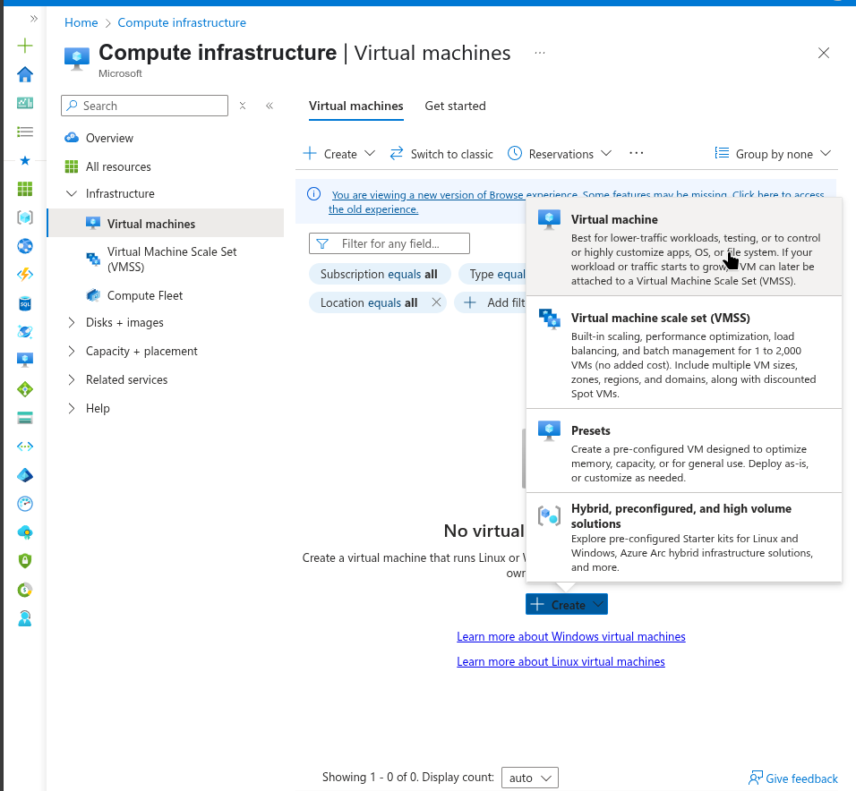

  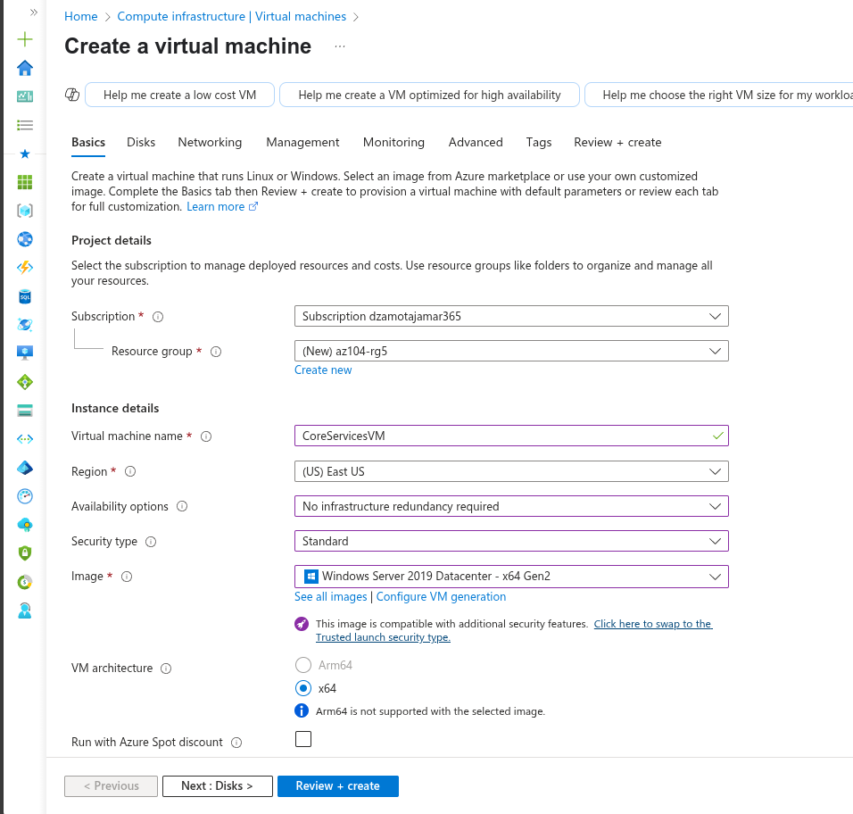

- On the **Disks** tab take the defaults and then select **Next: Networking >**.
- On the **Networking** tab, for Virtual network, select **Create new**.
- Use the following information to configure the virtual network, and then select **OK**. If necessary, remove or replace the existing information.

  | Setting | Value |
  | --- | --- |
  | Name | `CoreServicesVnet` (Create new) |
  | Address range | `10.0.0.0/16`  |
  | Subnet Name | `Core` |
  | Subnet address range | `10.0.0.0/24` |

  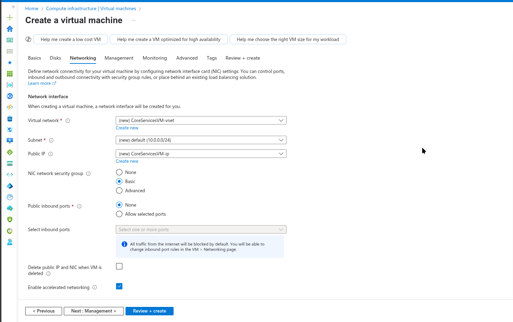

- Select the **Monitoring** tab. For Boot Diagnostics, select **Disable**.
- Select **Review + Create**, and then select **Create**.
- You do not need to wait for the resources to be created. Continue on to the next task.
  >**Note:** Did you notice in this task you created the virtual network as you created the virtual machine? You could also create the virtual network infrastructure then add the virtual machines.

### Alternative: Using Azure CLI

You can also create the resources using Azure Cloud Shell with the following commands:

```bash
# Create resource group
az group create --name az104-rg5 --location eastus

# Create the CoreServices virtual network
az network vnet create \
    --resource-group az104-rg5 \
    --name CoreServicesVnet \
    --address-prefixes 10.0.0.0/16 \
    --subnet-name Core \
    --subnet-prefixes 10.0.0.0/24

# Create the CoreServices VM
az vm create \
    --resource-group az104-rg5 \
    --name CoreServicesVM \
    --image Win2019Datacenter \
    --size Standard_DS2_v3 \
    --admin-username localadmin \
    --admin-password 'YourComplexPassword123!' \
    --vnet-name CoreServicesVnet \
    --subnet Core \
    --public-ip-address "" \
    --nsg "" \
    --location eastus
```

## Task 2: Create a virtual machine in a different virtual network

In this task, you create a manufacturing services virtual network with a virtual machine.

- From the Azure portal, search for and navigate to **Virtual Machines**.
- From the virtual machines page, select **Create** then select **Azure Virtual Machine**.
- On the Basics tab, use the following information to complete the form, and then select **Next: Disks >**. For any setting not specified, leave the default value.
  
  | Setting | Value |
  | --- | --- |
  | Subscription |  *your subscription* |
  | Resource group |  `az104-rg5` |
  | Virtual machine name |    `ManufacturingVM` |
  | Region | **(US) East US** |
  | Security type | **Standard** |
  | Availability options | No infrastructure redundancy required |
  | Image | **Windows Server 2019 Datacenter: x64 Gen2** |
  | Size | **Standard_DS2_v3** |
  | Username | `localadmin` |
  | Password | **Provide a complex password** |
  | Public inbound ports | **None** |

  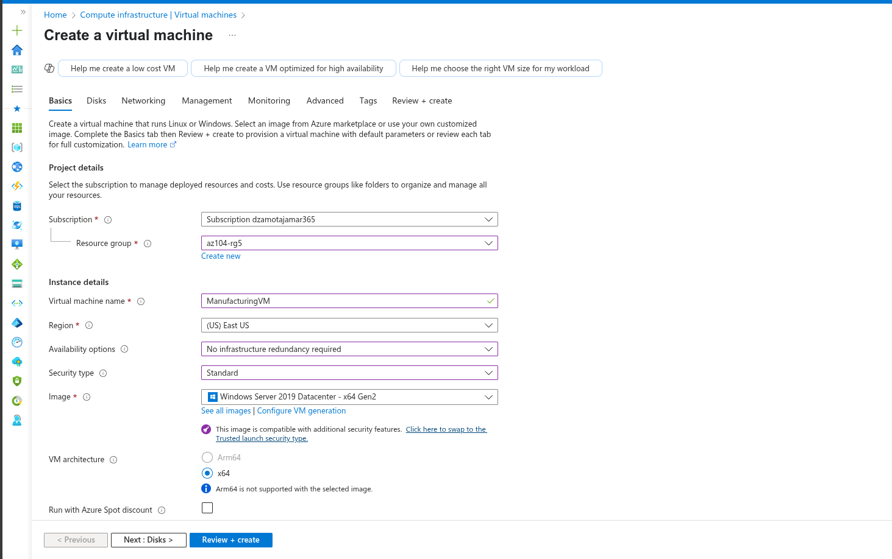

- On the **Disks** tab take the defaults and then select **Next: Networking >**.

- On the Networking tab, for Virtual network, select **Create new**.
- Use the following information to configure the virtual network, and then select **OK**.  If necessary, remove or replace the existing address range.
  
  | Setting | Value |
  | --- | --- |
  | Name | `ManufacturingVnet` |
  | Address range | `172.16.0.0/16`  |
  | Subnet Name | `Manufacturing` |
  | Subnet address range | `172.16.0.0/24` |

  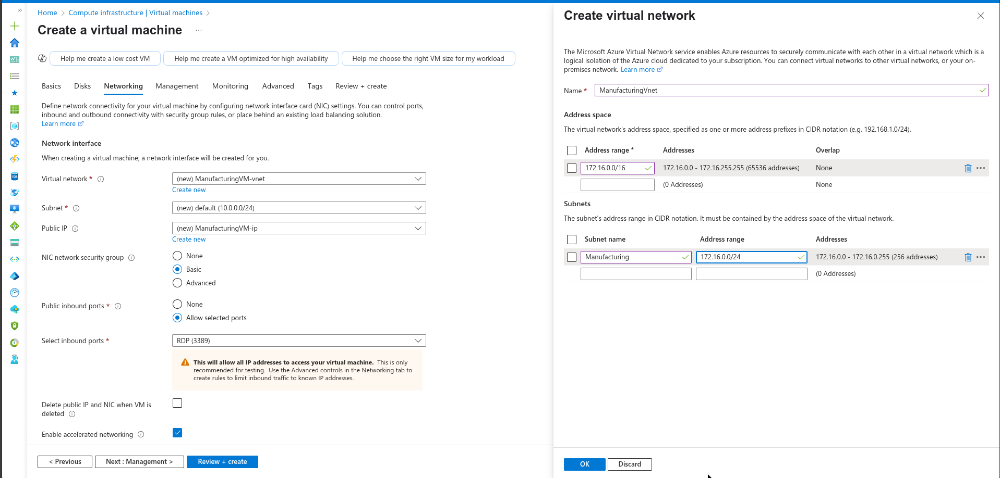

- Select the **Monitoring** tab. For Boot Diagnostics, select **Disable**.
- Select **Review + Create**, and then select **Create**.

### Alternative: Using Azure CLI

```bash
# Create the Manufacturing virtual network
az network vnet create \
    --resource-group az104-rg5 \
    --name ManufacturingVnet \
    --address-prefixes 172.16.0.0/16 \
    --subnet-name Manufacturing \
    --subnet-prefixes 172.16.0.0/24

# Create the Manufacturing VM
az vm create \
    --resource-group az104-rg5 \
    --name ManufacturingVM \
    --image Win2019Datacenter \
    --size Standard_DS2_v3 \
    --admin-username localadmin \
    --admin-password 'YourComplexPassword123!' \
    --vnet-name ManufacturingVnet \
    --subnet Manufacturing \
    --public-ip-address "" \
    --nsg "" \
    --location eastus
```

## Task 3: Use Network Watcher to test the connection between virtual machines

In this task, you verify that resources in peered virtual networks can communicate with each other. Network Watcher will be used to test the connection. Before continuing, ensure both virtual machines have been deployed and are running.

- From the Azure portal, search for and select `Network Watcher`.
- From Network Watcher, in the Network diagnostic tools menu, select **Connection troubleshoot**.
- Use the following information to complete the fields on the **Connection troubleshoot** page.
  
  | Field | Value |
  | --- | --- |
  | Source type           | **Virtual machine**   |
  | Virtual machine       | **CoreServicesVM**    |
  | Destination type      | **Virtual machine**   |
  | Virtual machine       | **ManufacturingVM**   |
  | Preferred IP Version  | **Both**              |
  | Protocol              | **TCP**               |
  | Destination port      | `3389`                |
  | Source port           | *Blank*         |
  | Diagnostic tests      | *Defaults*      |

  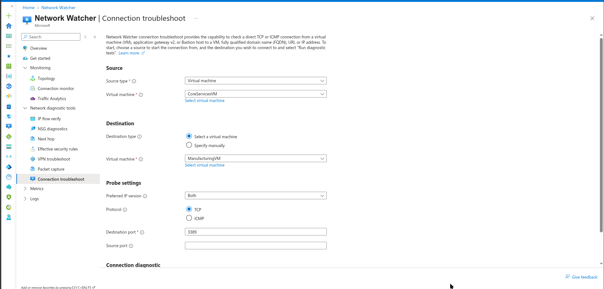

- Select **Run diagnostic tests**.
  >**Note**: It may take a couple of minutes for the results to be returned. The screen selections will be greyed out while the results are being collected. Notice the **Connectivity test** shows **UnReachable**. This makes sense because the virtual machines are in different virtual networks.

  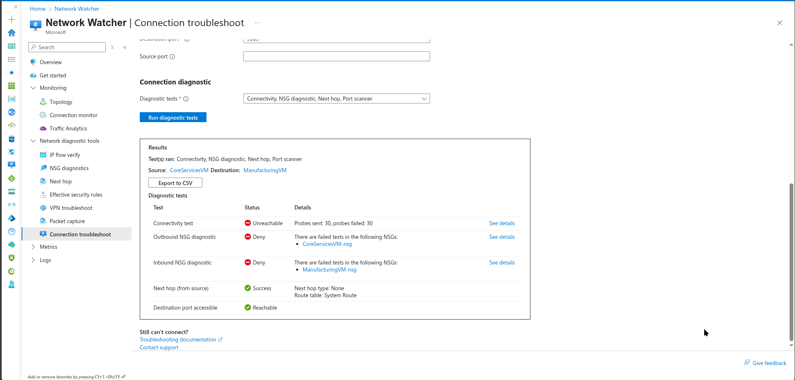

### Alternative: Using Azure CLI

```bash
# Test connection using Network Watcher (requires Network Watcher extension on source VM)
# First, get the resource IDs of both VMs
CORE_VM_ID=$(az vm show --resource-group az104-rg5 --name CoreServicesVM --query id --output tsv)
MANUFACTURING_VM_ID=$(az vm show --resource-group az104-rg5 --name ManufacturingVM --query id --output tsv)

# Get the private IP of the Manufacturing VM
MANUFACTURING_IP=$(az vm show --resource-group az104-rg5 --name ManufacturingVM --show-details --query privateIps --output tsv)

# Run connectivity test
az network watcher test-connectivity \
    --source-resource $CORE_VM_ID \
    --dest-resource $MANUFACTURING_VM_ID \
    --protocol TCP \
    --dest-port 3389
```

## Task 4: Configure virtual network peerings between virtual networks

In this task, you create a virtual network peering to enable communications between resources in the virtual networks.

- In the Azure portal, select the `CoreServicesVnet` virtual network.
- In CoreServicesVnet, under **Settings**, select **Peerings**.
- On CoreServicesVnet, under Peerings, select **+ Add**. If not specified, take the default.

  | **Parameter**                                    | **Value**                             |
  | --------------------------------------------- | ------------------------------------- |
  | Peering link name                             | `CoreServicesVnet-to-ManufacturingVnet` |
  | Virtual network    | **ManufacturingVM-net (az104-rg5)**  |
  | Allow ManufacturingVnet to access CoreServicesVnet  | selected (default) |
  | Allow ManufacturingVnet to receive forwarded traffic from CoreServicesVnet | selected  |
  | Peering link name                             | `ManufacturingVnet-to-CoreServicesVnet` |
  | Allow CoreServicesVnet to access the peered virtual network            | selected (default) |
  | Allow CoreServicesVnet to receive forwarded traffic from the peered virtual network | selected |

  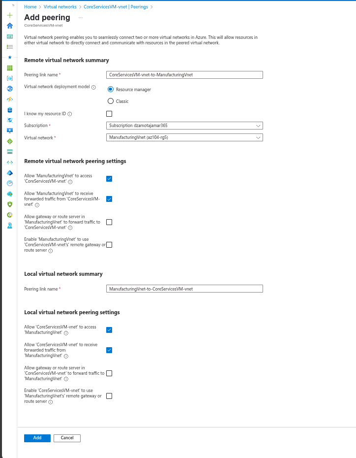

- Click **Add**.
- In CoreServicesVnet, under Peerings, verify that the **CoreServicesVnet-to-ManufacturingVnet** peering is listed. Refresh the page to ensure the **Peering status** is **Connected**.
- Switch to the **ManufacturingVnet** and verify the **ManufacturingVnet-to-CoreServicesVnet** peering is listed. Ensure the **Peering status** is **Connected**. You may need to **Refresh** the page.

  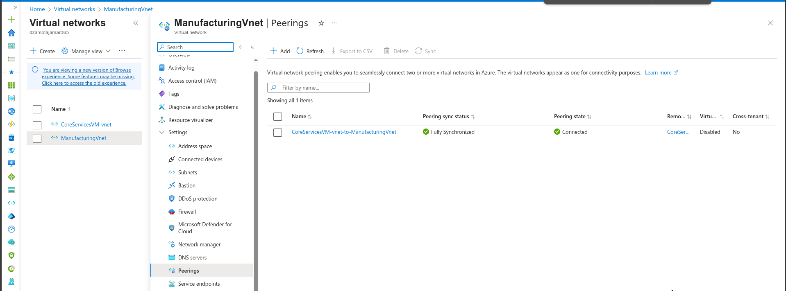

### Alternative: Using Azure CLI

```bash
# Create peering from CoreServicesVnet to ManufacturingVnet
az network vnet peering create \
    --resource-group az104-rg5 \
    --name CoreServicesVnet-to-ManufacturingVnet \
    --vnet-name CoreServicesVnet \
    --remote-vnet ManufacturingVnet \
    --allow-vnet-access \
    --allow-forwarded-traffic

# Create peering from ManufacturingVnet to CoreServicesVnet
az network vnet peering create \
    --resource-group az104-rg5 \
    --name ManufacturingVnet-to-CoreServicesVnet \
    --vnet-name ManufacturingVnet \
    --remote-vnet CoreServicesVnet \
    --allow-vnet-access \
    --allow-forwarded-traffic

# Verify peering status
az network vnet peering list \
    --resource-group az104-rg5 \
    --vnet-name CoreServicesVnet \
    --output table

az network vnet peering list \
    --resource-group az104-rg5 \
    --vnet-name ManufacturingVnet \
    --output table
```

## Task 5: Use Azure PowerShell to test the connection between virtual machines

In this task, you retest the connection between the virtual machines in different virtual networks.

### Verify the private IP address of the CoreServicesVM

- From the Azure portal, search for and select the `CoreServicesVM` virtual machine.
- On the **Overview** blade, in the **Networking** section, record the **Private IP address** of the machine. You need this information to test the connection.

  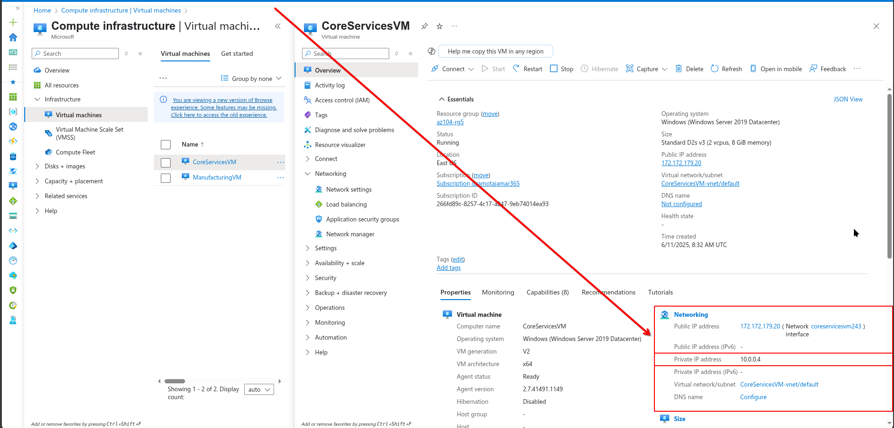

### Alternative: Using Azure CLI

```bash
# Get the private IP address of CoreServicesVM
az vm show --resource-group az104-rg5 --name CoreServicesVM --show-details --query privateIps --output tsv
```

### Test the connection to the CoreServicesVM from the **ManufacturingVM**.

>**Did you know?** There are many ways to check connections. In this task, you use **Run command**. You could also continue to use Network Watcher. Or you could use a [Remote Desktop Connection](https://learn.microsoft.com/azure/virtual-machines/windows/connect-rdp#connect-to-the-virtual-machine) to the access the virtual machine. Once connected, use **test-connection**. As you have time, give RDP a try.

- Switch to the `ManufacturingVM` virtual machine.
- In the **Operations** blade, select the **Run command** blade.
- Select **RunPowerShellScript** and run the **Test-NetConnection** command. Be sure to use the private IP address of the **CoreServicesVM**.
  ```Powershell
  Test-NetConnection <CoreServicesVM private IP address> -port 3389
  ```
- It may take a couple of minutes for the script to time out. The top of the page shows an informational message *Script execution in progress.*

  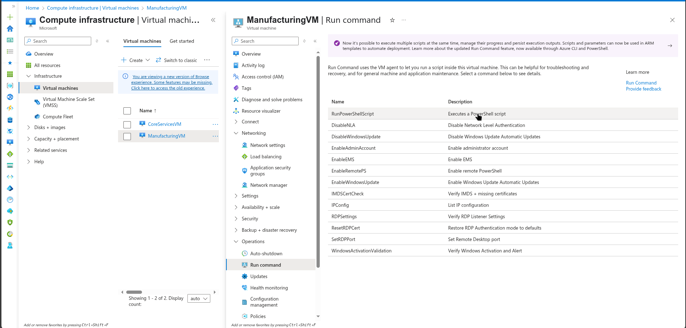

- The test connection should succeed because peering has been configured. Your computer name and remote address in this graphic may be different.

  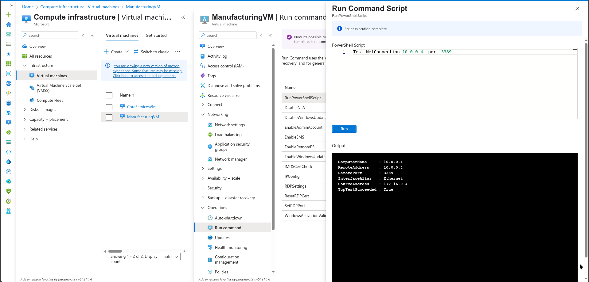

### Alternative: Using Azure CLI

```bash
# Run PowerShell command on ManufacturingVM to test connection
# First get the private IP of CoreServicesVM
CORE_VM_IP=$(az vm show --resource-group az104-rg5 --name CoreServicesVM --show-details --query privateIps --output tsv)

# Run the Test-NetConnection command on ManufacturingVM
az vm run-command invoke \
    --resource-group az104-rg5 \
    --name ManufacturingVM \
    --command-id RunPowerShellScript \
    --scripts "Test-NetConnection $CORE_VM_IP -port 3389"
```

## Task 6: Create a custom route

In this task, you want to control network traffic between the perimeter subnet and the internal core services subnet. A virtual network appliance will be installed in the core services subnet and all traffic should be routed there.

- Search for select the `CoreServicesVnet`.
- Select **Subnets** and then **+ Subnet**. Be sure to select **Add** to save your changes.

  | Setting | Value |
  | --- | --- |
  | Name | `perimeter` |
  | Starting address | `10.0.1.0/24`  |

  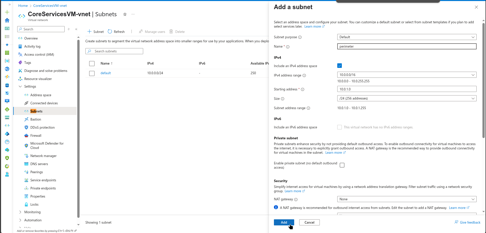

### Alternative: Using Azure CLI

```bash
# Add perimeter subnet to CoreServicesVnet
az network vnet subnet create \
    --resource-group az104-rg5 \
    --vnet-name CoreServicesVnet \
    --name perimeter \
    --address-prefixes 10.0.1.0/24
```

- In the Azure portal, search for and select `Route tables`, select **+ Create**.
- Enter the following details, select **Review + Create**, and then select **Create**.
 
  | Setting | Value |
  | --- | --- |
  | Subscription | your subscription |
  | Resource group | `az104-rg5`  |
  | Region | **East US** |
  | Name | `rt-CoreServices` |
  | Propagate gateway routes | **No** |

  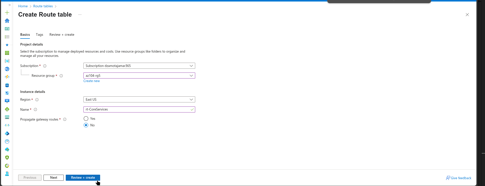

### Alternative: Using Azure CLI

```bash
# Create route table
az network route-table create \
    --resource-group az104-rg5 \
    --name rt-CoreServices \
    --location eastus \
    --disable-bgp-route-propagation true
```

- After the route table deploys, Search for and select the **Route Tables**.
- Select the resource (not the checkbox) **rt-CoreServices**
- Expand **Settings** then select **Routes** and then **Add**. Create a route from a future Network Virtual Appliance (NVA) to the CoreServices virtual network.

  | Setting | Value |
  | --- | --- |
  | Route name | `PerimetertoCore` |
  | Destination type | **IP Addresses** |
  | Destination IP addresses | `10.0.0.0/16` (core services virtual network) |
  | Next hop type | **Virtual appliance** (notice your other choices) |
  | Next hop address | `10.0.1.7` (future NVA) |

  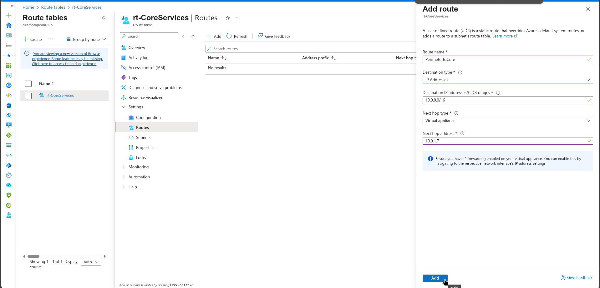

- Select **+ Add**. The last thing to do is associate the route with the subnet.
- Select **Subnets** and then **+ Associate**. Complete the configuration.

  | Setting | Value |
  | --- | --- |
  | Virtual network | **CoreServicesVnet** |
  | Subnet | **Core**/ (perimeter or default) |

  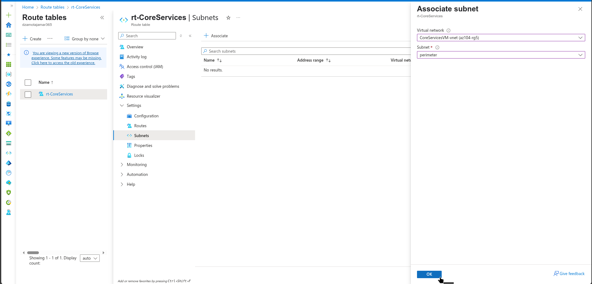

### Alternative: Using Azure CLI

```bash
# Create custom route
az network route-table route create \
    --resource-group az104-rg5 \
    --route-table-name rt-CoreServices \
    --name PerimetertoCore \
    --address-prefix 10.0.0.0/16 \
    --next-hop-type VirtualAppliance \
    --next-hop-ip-address 10.0.1.7

# Associate route table with Core subnet
az network vnet subnet update \
    --resource-group az104-rg5 \
    --vnet-name CoreServicesVnet \
    --name Core \
    --route-table rt-CoreServices

# Verify route table association
az network route-table show \
    --resource-group az104-rg5 \
    --name rt-CoreServices \
    --query subnets \
    --output table
```

>**Note**: You have created a user defined route to direct traffic from the DMZ to the new NVA.

## Cleanup your resources

If you are working with **your own subscription** take a minute to delete the lab resources. This will ensure resources are freed up and cost is minimized. The easiest way to delete the lab resources is to delete the lab resource group.

+ In the Azure portal, select the resource group, select **Delete the resource group**, **Enter resource group name**, and then click **Delete**.
+ Using Azure PowerShell, `Remove-AzResourceGroup -Name resourceGroupName`.
+ Using the CLI, `az group delete --name resourceGroupName`.

### Using Azure CLI for cleanup:

```bash
# Delete the resource group and all resources
az group delete --name az104-rg5 --yes --no-wait
```

## Extend your learning with Copilot
Copilot can assist you in learning how to use the Azure scripting tools. Copilot can also assist in areas not covered in the lab or where you need more information. Open an Edge browser and choose Copilot (top right) or navigate to *copilot.microsoft.com*. Take a few minutes to try these prompts.

+ How can I use Azure PowerShell or Azure CLI commands to add a virtual network peering between vnet1 and vnet2?
+ Create a table highlighting various Azure and 3rd party monitoring tools supported on Azure. Highlight when to use each tool.
+ When would I create a custom network route in Azure?

## Learn more with self-paced training

+ [Distribute your services across Azure virtual networks and integrate them by using virtual network peering](https://learn.microsoft.com/en-us/training/modules/integrate-vnets-with-vnet-peering/). Use virtual network peering to enable communication across virtual networks in a way that's secure and minimally complex.
+ [Manage and control traffic flow in your Azure deployment with routes](https://learn.microsoft.com/training/modules/control-network-traffic-flow-with-routes/). Learn how to control Azure virtual network traffic by implementing custom routes.


## Key takeaways

Congratulations on completing the lab. Here are the main takeaways for this lab.

+ By default, resources in different virtual networks cannot communicate.
+ Virtual network peering enables you to seamlessly connect two or more virtual networks in Azure.
+ Peered virtual networks appear as one for connectivity purposes.
+ The traffic between virtual machines in peered virtual networks uses the Microsoft backbone infrastructure.
+ System defined routes are automatically created for each subnet in a virtual network. User-defined routes override or add to the default system routes.
+ Azure Network Watcher provides a suite of tools to monitor, diagnose, and view metrics and logs for Azure IaaS resources.
